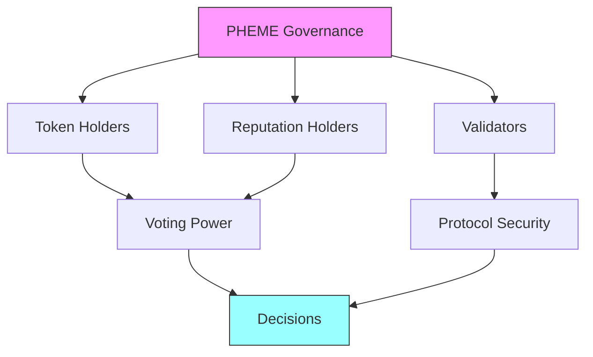
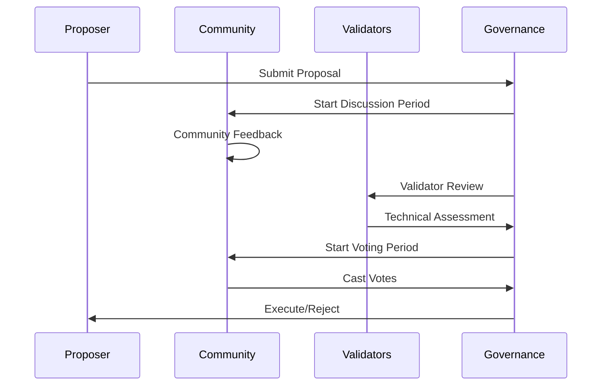
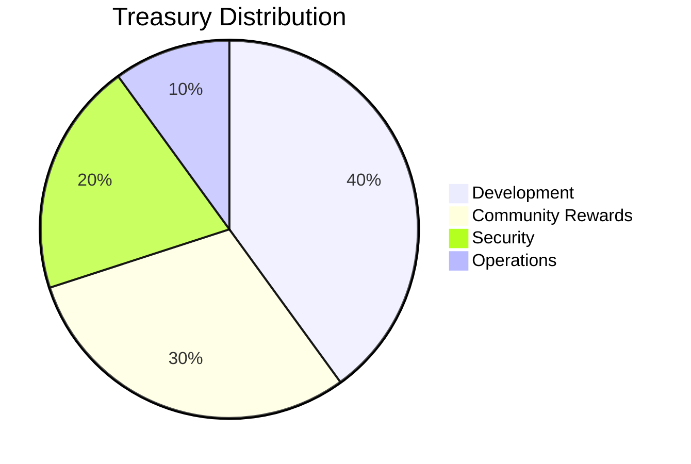
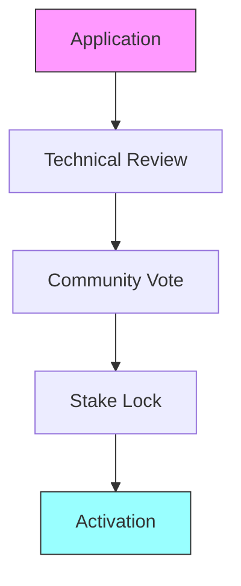

# 🏛️ Governance Model


The PHEME Protocol governance model empowers community members to participate in decision-making and protocol evolution through a reputation-weighted voting system.


## Governance Overview





### Core Elements
* Token-based voting
* Reputation multipliers
* Validator consensus
* Community proposals
* Treasury management


Your voting power is determined by both your token holdings and reputation score.




### Voting Power Calculation

```typescript
interface VotingPower {
  baseTokens: number;      // PHEME token holdings
  reputation: number;      // Reputation score (0-100)
  multiplier: number;      // Reputation multiplier
  validatorStatus: boolean; // Active validator bonus
}

// Voting power formula
votingPower = baseTokens * (1 + (reputation * multiplier))
```


Tokens must be staked for at least 7 days before they count towards voting power.




### Governance Thresholds

| Action | Requirement | Quorum |
|--------|-------------|--------|
| Create Proposal | 10,000 PHEME | N/A |
| Basic Vote | 1,000 PHEME | 10% |
| Core Changes | 5,000 PHEME | 30% |
| Emergency Actions | 20,000 PHEME | 50% |


Thresholds are adjustable through governance proposals.




## Proposal System



### Creating a Proposal

1. **Requirements**
   * Minimum token holding
   * Required reputation score
   * Detailed documentation
   * Community discussion

2. **Proposal Types**
   ```typescript
   enum ProposalType {
     PARAMETER_CHANGE,
     PROTOCOL_UPGRADE,
     TREASURY_ALLOCATION,
     VALIDATOR_UPDATE,
     EMERGENCY_ACTION
   }
   ```

3. **Submission Process**
   * Draft proposal
   * Community feedback
   * Formal submission
   * Voting period


Use our [Proposal Template](./templates/proposal-template.md) for structured submissions.




### Voting Mechanics



1. **Voting Options**
   * For
   * Against
   * Abstain

2. **Voting Period**
   * Discussion: 3 days
   * Voting: 5 days
   * Execution: 2 days



### Emergency Procedures

1. **Qualifying Events**
   * Security vulnerabilities
   * Critical bugs
   * Market risks
   * Protocol attacks

2. **Fast-Track Process**
   * Validator alert
   * Emergency proposal
   * Rapid voting
   * Immediate execution


Emergency actions require super-majority approval and validator consensus.




## Treasury Management



### Treasury Allocation




Treasury allocations are reviewed and adjusted quarterly through governance.




### Management Strategy

1. **Investment Categories**
   * Protocol development
   * Community initiatives
   * Security measures
   * Ecosystem growth

2. **Risk Levels**
   * Conservative (40%)
   * Moderate (40%)
   * Growth (20%)


All treasury movements require multi-sig approval and community consensus.




### Community Rewards

| Activity | Reward Range | Frequency |
|----------|-------------|-----------|
| Proposals | 100-1000 PHEME | Per accepted proposal |
| Validation | 50-200 PHEME | Per validation |
| Development | 500-5000 PHEME | Per milestone |
| Content | 100-500 PHEME | Per piece |


Rewards are distributed automatically through smart contracts.




## Validator System



### Becoming a Validator

1. **Technical Requirements**
   * High-availability infrastructure
   * Security measures
   * Performance metrics
   * Monitoring systems

2. **Stake Requirements**
   * Minimum: 50,000 PHEME
   * Lock period: 3 months
   * Slashing conditions
   * Performance bonds


Validators must maintain 99.9% uptime and meet performance metrics.




### Core Duties

1. **Network Security**
   * Transaction validation
   * Block production
   * Network monitoring
   * Threat detection

2. **Governance Participation**
   * Proposal review
   * Technical assessment
   * Emergency response
   * Community guidance

3. **Performance Metrics**
   ```typescript
   interface ValidatorMetrics {
     uptime: number;        // 99.9% required
     responseTime: number;  // < 100ms
     validations: number;   // Weekly minimum
     reputation: number;    // Minimum 90/100
   }
   ```



### Selection Process



1. **Selection Criteria**
   * Technical expertise
   * Community standing
   * Infrastructure quality
   * Security measures

2. **Ongoing Requirements**
   * Regular audits
   * Performance reviews
   * Community feedback
   * Continuous education



## Participation Guidelines



### Community Participation

1. **Engagement Levels**
   * Basic voter
   * Active proposer
   * Core contributor
   * Validator node

2. **Responsibilities**
   * Informed voting
   * Constructive feedback
   * Protocol security
   * Community growth


Start with basic voting and gradually increase your involvement.




### Governance Resources

1. **Documentation**
   * Governance guides
   * Technical docs
   * Best practices
   * Case studies

2. **Tools**
   * Voting dashboard
   * Proposal creator
   * Analytics tools
   * Simulation tools


All governance tools are open-source and community-maintained.




### Governance Guidelines

1. **Proposal Creation**
   * Clear objectives
   * Detailed analysis
   * Impact assessment
   * Implementation plan

2. **Voting Conduct**
   * Research thoroughly
   * Discuss openly
   * Vote responsibly
   * Accept outcomes


Follow our [Code of Conduct](../../CODE_OF_CONDUCT.md) for all governance activities.




## Next Steps


Ready to participate in governance?
* [🗳️ View Active Proposals](https://governance@phemeai.xyz)
* [📝 Create a Proposal](./templates/proposal-template.md)
* [💬 Join Governance Forum](https://forum@phemeai.xyz)
* [📊 View Analytics](https://analytics@phemeai.xyz)



Need help with governance? Join our [Governance Working Group](https://discord.gg/pheme-governance) on Discord!
 
