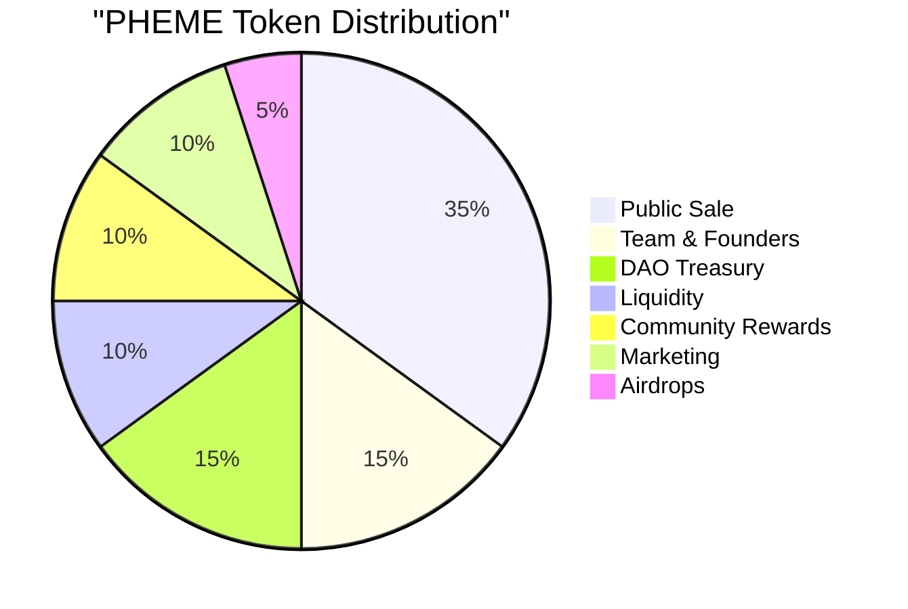

# 💰 PHEME Token Economics

> 🔗 **Related**: See [Governance Model](02-governance-model.md) for how tokens are used in governance.

## Token Overview

### Basic Information
- **Name:** PHEME Token
- **Symbol:** $PHEME
- **Type:** ERC-20
- **Network:** Base
- **Total Supply:** 1,000,000,000 (1 billion)
- **Decimals:** 18

> 📊 **Analytics**: Track token metrics on [Token Dashboard](coming soon).

## Token Distribution

### Initial Allocation

| Category | Percentage | Amount | Vesting |
|----------|------------|--------|---------|
| Public Sale | 35% | 350M | Unlocked at TGE |
| Team & Founders | 15% | 150M | 1-month cliff + 24-month linear |
| DAO Treasury | 15% | 150M | Proposal-based release |
| Liquidity | 10% | 100M | Locked 1 month |
| Community Rewards | 10% | 100M | Released over 36 months |
| Marketing | 10% | 100M | Fully unlocked at launch |
| Airdrops | 5% | 50M | Fully unlocked at launch |



> 🔒 **Security**: Review [Security Model](03-security-model.md) for token contract security.

## Vesting Schedule

### Team & Founders
```typescript
interface VestingSchedule {
    cliff: "1 month",
    duration: "24 months",
    release: "Linear monthly",
    start: "Token Generation Event (TGE)"
}
```

### Release Schedule
| Month | Team Unlock | Community Rewards | Cumulative |
|-------|------------|-------------------|------------|
| 0 (TGE) | 0% | 0% | 0% |
| 6 | 25% | 16.67% | 16.67% |
| 12 | 50% | 33.33% | 58.33% |
| 18 | 75% | 50% | 100% |
| 24 | 100% | 66.67% | 141.67% |
| 30 | 100% | 83.33% | 183.33% |
| 36 | 100% | 100% | 200% |

> 📅 **Timeline**: See [Roadmap](../overview/03-roadmap.md) for token release milestones.

## Token Utility

### Governance
- Proposal submission (min 0.1% supply)
- Voting power base
- DAO treasury control
- Parameter updates

### Platform Benefits
- XP multipliers
- Priority task access
- Enhanced AI features
- Special badge minting
- Guild creation rights

### Staking Benefits
- Increased rewards
- Exclusive content
- Premium features
- Guild perks
- Governance weight

> 🎮 **Features**: Check [Core Features](../technical/10-skill-system.md) for utility details.

## Economic Model

### Value Capture
```typescript
interface ValueFlows {
    inflows: [
        "Platform fees",
        "Integration licenses",
        "Premium features",
        "Guild subscriptions",
        "Validator stakes"
    ],
    outflows: [
        "Contributor rewards",
        "Validator rewards",
        "Community grants",
        "Development funding",
        "Marketing initiatives"
    ]
}
```

### Token Burn Mechanism
- % of platform fees
- Validator slashing
- Inactive guild dissolution
- Expired badge recycling

> 💹 **Metrics**: Monitor burn rate on [Analytics Dashboard](https://analytics.phemeai.xyz).

## Liquidity Management

### DEX Pairs
- Base: PHEME/ETH
- Base: PHEME/USDC
- Future cross-chain bridges

### Liquidity Incentives
- LP staking rewards
- Trading fee share
- Bonus multipliers
- Special governance rights

## Treasury Management

### Revenue Streams
- Platform fees (2%)
- Integration licenses
- Premium subscriptions
- Partnership revenue
- Investment returns

### Expenditure Categories
1. Development
   - Core protocol
   - New features
   - Security audits
   - Infrastructure

2. Community
   - Rewards program
   - Events & hackathons
   - Content creation
   - Education initiatives

3. Marketing
   - Brand awareness
   - User acquisition
   - Partnership development
   - Market making

4. Operations
   - Team salaries
   - Legal & compliance
   - Administrative costs
   - Tool subscriptions

> 📊 **Tracking**: View treasury analytics on [DAO Dashboard](https://dao.phemeai.xyz).

## Token Security

### Smart Contract Security
- Multi-sig controls
- Timelock mechanisms
- Upgrade controls
- Emergency pause

### Holder Protection
- Transfer limits
- Anti-bot measures
- Slippage controls
- Flash loan protection

## Governance Rights

### Proposal Power
```typescript
interface ProposalRights {
    minimumHolding: "0.1% of supply",
    votingPower: "tokens × reputation multiplier",
    delegationAllowed: true,
    votingPeriod: "7 days"
}
```

### Special Rights
- Emergency proposals
- Parameter updates
- Treasury access
- Contract upgrades

> 🏛️ **Details**: See [Governance Model](02-governance-model.md) for complete rights.

## Future Considerations

### Potential Updates
- Cross-chain expansion
- New utility features
- Economic parameter adjustments
- Additional burn mechanisms

### Development Roadmap
1. **Phase 1: Foundation**
   - Initial distribution
   - Basic utility
   - Core governance

2. **Phase 2: Expansion**
   - Enhanced utility
   - Cross-chain bridges
   - Advanced governance

3. **Phase 3: Optimization**
   - Economic refinements
   - New use cases
   - Market making

> 🗺️ **Planning**: Check [Project Roadmap](../overview/03-roadmap.md) for timeline.

## Resources

### Official Links
- [Token Contract](https://basescan.org/token/pheme)
- [Github](https://github.com/autonomous-pheme/token)
- [Documentation](https://docs.phemeai.xyz/token)

### Tools
- Token Explorer
- Vesting Calculator
- Governance Dashboard
- Analytics Platform

## Updates & Maintenance

This tokenomics model is subject to governance updates based on:
- Market conditions
- Community feedback
- Protocol requirements
- Economic optimization

> 📝 **Changes**: Follow [Version Management](../technical/53-versioning.md) for updates.
