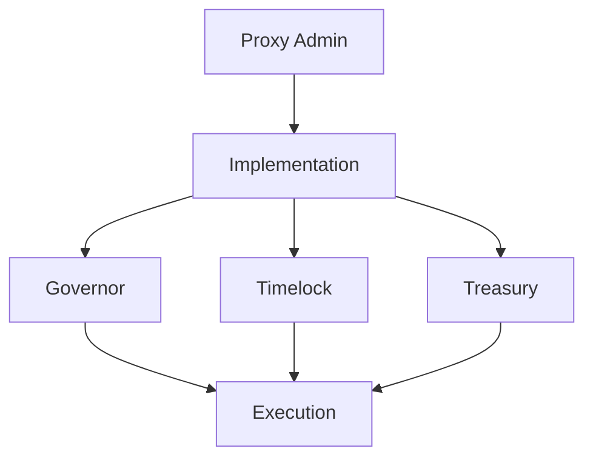

# Security Model

> 🔗 **Related**: See [Governance Model](02-governance-model.md) for governance security measures.

## Overview

PHEME Protocol implements a comprehensive security model to protect the protocol, its users, and their assets through multiple layers of safeguards and controls.

### Core Principles

* Defense in depth
* Least privilege access
* Transparent operations
* Regular audits
* Community oversight

> 🛡️ **Protection**: Review [Technical Security](../technical/05-security.md) for implementation details.

## Smart Contract Security

### Contract Architecture



### Security Features

1. **Upgradability**
   * Transparent proxy pattern
   * Timelock delays
   * Multi-sig control
   * Emergency pause
2. **Access Control**
   * Role-based permissions
   * Function modifiers
   * Guard checks
   * Event logging
3. **Value Protection**
   * Reentrancy guards
   * Integer overflow checks
   * Balance validations
   * Transfer limits

> ⚙️ **Technical**: See [Smart Contracts](../developer-guide/01-smart-contracts.md) for implementation.

## Governance Security

### Proposal Protection

* Minimum token requirement (TBD)
* Review period
* Timelock delay (48h)
* Emergency cancellation
* Multi-sig oversight

### Voting Security

```typescript
interface VotingSecurity {
    quorum: "4% of total power",
    delay: "1 block",
    period: "7 days",
    execution: "timelock controlled",
    emergency: "guardian pause"
}
```

### Treasury Security

* 5-of-7 multi-sig
* Spending limits
* Transaction delays
* Audit trail
* Regular reporting

> 💰 **Economics**: Check [Token Economics](01-tokenomics.md) for treasury management.

## Operational Security

### Infrastructure

* Distributed validators
* Redundant systems
* DDoS protection
* Regular backups
* Monitoring systems

### Access Management

| Role      | Access Level | Requirements       |
| --------- | ------------ | ------------------ |
| Admin     | Full         | Multi-sig (5/7)    |
| Operator  | Limited      | 2FA + Hardware Key |
| Validator | Specific     | Staked + Verified  |
| User      | Basic        | Wallet Connection  |

### Monitoring & Alerts

* 24/7 network monitoring
* Automated alerts
* Performance metrics
* Security events
* Validator health

> 🔍 **Monitoring**: View system status on [Status Page](https://status.phemeai.xyz).

## Risk Management

### Risk Categories

1. **Smart Contract Risk**
   * Code vulnerabilities
   * Logic errors
   * Upgrade failures
   * Integration issues
2. **Economic Risk**
   * Token volatility
   * Liquidity issues
   * Market manipulation
   * Flash loan attacks
3. **Operational Risk**
   * Infrastructure failure
   * Human error
   * Social engineering
   * Data loss
4. **Regulatory Risk**
   * Compliance issues
   * Legal changes
   * Jurisdiction conflicts
   * Reporting requirements

### Mitigation Strategies

```typescript
interface RiskMitigation {
    technical: [
        "Regular audits",
        "Penetration testing",
        "Bug bounties",
        "Code reviews"
    ],
    economic: [
        "Value caps",
        "Rate limits",
        "Circuit breakers",
        "Insurance funds"
    ],
    operational: [
        "Team training",
        "Process documentation",
        "Incident response",
        "Disaster recovery"
    ]
}
```

> 🎯 **Planning**: See [Risk Management](../technical/06-risk-management.md) for detailed strategies.

## Incident Response

### Response Process

1. **Detection**
   * Automated monitoring
   * User reports
   * Validator alerts
   * Security scans
2. **Assessment**
   * Impact analysis
   * Scope determination
   * Risk evaluation
   * Response planning
3. **Mitigation**
   * Emergency pause
   * Fix deployment
   * Communication
   * Recovery steps
4. **Review**
   * Incident analysis
   * Process improvement
   * Documentation update
   * Team training

### Emergency Actions

* Contract pause
* Trading halt
* Emergency proposals
* Community alerts
* Asset protection

> 🚨 **Response**: Follow [Incident Response](../technical/07-incident-response.md) procedures.

## Audit & Compliance

### Security Audits

* Quarterly smart contract audits
* Annual penetration testing
* Regular code reviews
* Community bug bounties

### Compliance Framework

* KYC/AML integration
* Regulatory reporting
* Privacy compliance
* Data protection

### Documentation

* Security policies
* Procedure guides
* Incident reports
* Audit findings

> 📋 **Records**: Access [Audit Reports](https://github.com/autonomous-pheme/audits).

## Community Security

### User Protection

* Wallet safety guides
* Phishing protection
* Transaction verification
* Support channels

### Education & Training

* Security best practices
* Risk awareness
* Incident reporting
* Safe trading guides

### Communication

* Security updates
* Incident alerts
* Status reports
* Educational content

> 🤝 **Support**: Join [Security Channel](https://discord.gg/pheme-security).

## Tools & Resources

### Security Tools

* Contract Explorer
* Transaction Scanner
* Risk Calculator
* Audit Dashboard

### Emergency Contacts

* Security Team: security@phemeai.xyz
* Bug Reports: bugs@phemeai.xyz
* Support: support@phemeai.xyz
* Emergency: emergency@phemeai.xyz

## Updates & Maintenance

The security model is continuously improved through:

* Threat analysis
* Vulnerability assessments
* Community feedback
* Industry standards
* Regulatory changes

> 📝 **Changes**: Follow [Version Management](../technical/53-versioning.md) for updates.
