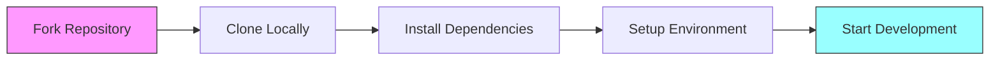
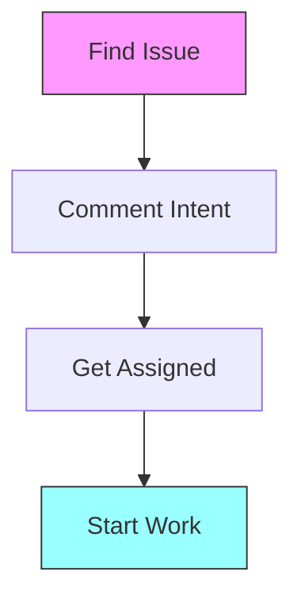
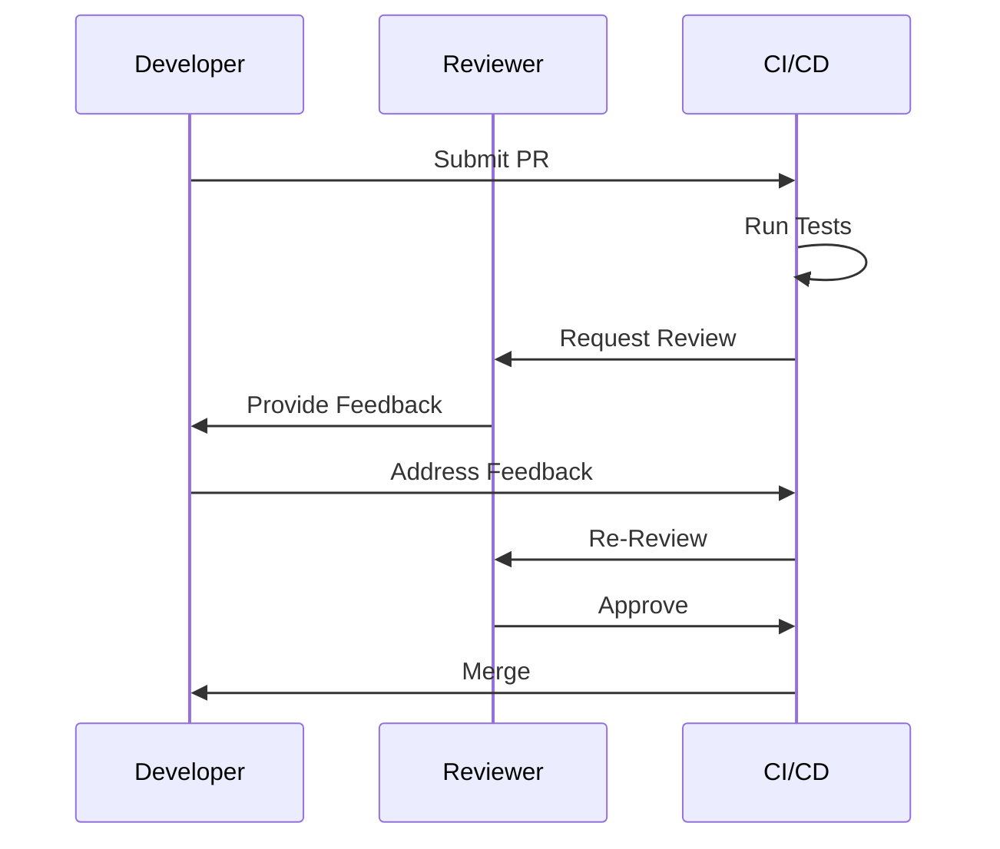
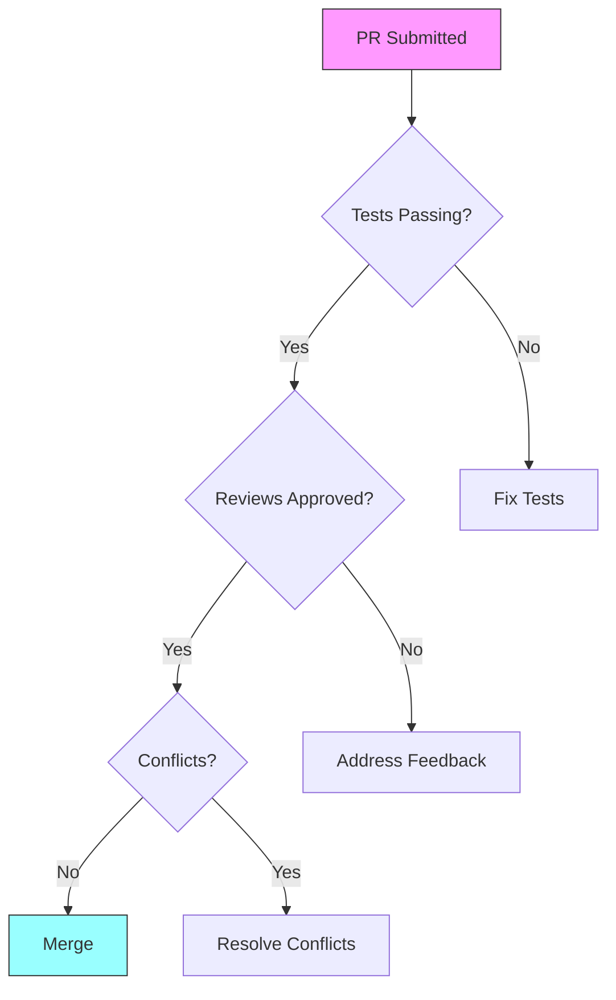
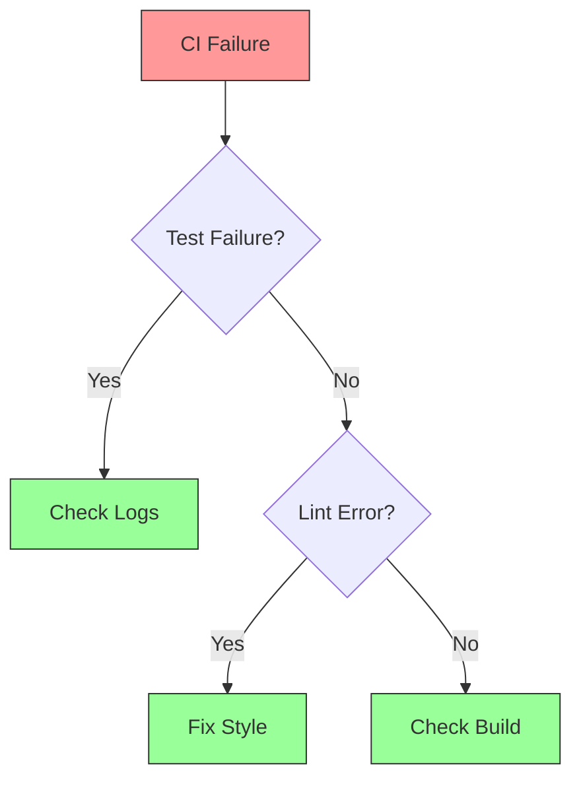

# 🤝 Contribution Guidelines

## Overview

This document outlines the technical contribution standards, workflows, and community guidelines for the Pheme Protocol. It provides detailed instructions for code contributions, documentation updates, and community participation.

## Code Contribution Standards

### Development Environment

```bash
# Fork and clone repository
git clone https://github.com/your-username/Pheme-Protocol.git
cd Pheme-Protocol

# Set up upstream
git remote add upstream https://github.com/PhemeAI/Pheme-Protocol.git

# Create feature branch
git checkout -b feature/your-feature-name
```

### Code Quality Requirements

```typescript
// Example of expected code style and documentation
/**
 * Calculates user's reputation score based on validated skills
 * @param userId - The user's blockchain address
 * @param skills - Array of validated skill IDs
 * @returns Computed reputation score (0-100)
 * @throws {ValidationError} If skills array is empty
 */
async function calculateReputation(
  userId: string,
  skills: string[]
): Promise<number> {
  if (!skills.length) {
    throw new ValidationError('User must have at least one validated skill');
  }
  
  // Implementation
}
```

### Testing Standards

```typescript
// Example test structure
describe('ReputationCalculator', () => {
  let calculator: ReputationCalculator;
  
  beforeEach(() => {
    calculator = new ReputationCalculator();
  });
  
  it('should calculate correct score for validated skills', async () => {
    const result = await calculator.calculateReputation(
      '0x123...', 
      ['skill1', 'skill2']
    );
    expect(result).to.be.within(0, 100);
  });
  
  it('should throw error for empty skills array', async () => {
    await expect(
      calculator.calculateReputation('0x123...', [])
    ).to.be.rejectedWith('User must have at least one validated skill');
  });
});
```

## Contribution Workflow


This guide outlines the process for contributing to the Pheme Protocol codebase. Following these guidelines ensures smooth collaboration and maintains code quality.


## Getting Started



### Development Environment



1. **Fork & Clone**
   ```bash
   git clone https://github.com/your-username/Pheme-Protocol.git
   cd Pheme-Protocol
   ```

2. **Dependencies**
   ```bash
   npm install
   ```

3. **Environment**
   ```bash
   cp .env.example .env
   # Configure your environment variables
   ```


Use `nvm` to ensure you're using the correct Node.js version.




### Branch Naming

```typescript
type BranchPrefix =
  | 'feature'    // New features
  | 'fix'        // Bug fixes
  | 'refactor'   // Code improvements
  | 'docs'       // Documentation
  | 'test'       // Testing
  | 'chore';     // Maintenance

// Example: feature/skill-validation
```


Always create branches from the latest `main` branch.




### Test Environment

1. **Unit Tests**
   ```bash
   npm run test:unit
   ```

2. **Integration Tests**
   ```bash
   npm run test:integration
   ```

3. **E2E Tests**
   ```bash
   npm run test:e2e
   ```


All tests must pass before submitting a PR.




## Development Process



### Working with Issues



1. **Issue Selection**
   * Check [Good First Issues](https://github.com/PhemeAI/Pheme-Protocol/labels/good-first-issue)
   * Review [Help Wanted](https://github.com/PhemeAI/Pheme-Protocol/labels/help-wanted)
   * Look for unassigned issues

2. **Issue Communication**
   * Comment your interest
   * Ask clarifying questions
   * Discuss approach
   * Get assignment


Issues are assigned on a first-come, first-served basis.




### Development Workflow

1. **Create Branch**
   ```bash
   git checkout -b feature/your-feature-name
   ```

2. **Regular Commits**
   ```bash
   git add .
   git commit -m "feat(scope): description"
   ```

3. **Stay Updated**
   ```bash
   git fetch origin
   git rebase origin/main
   ```


Commit messages must follow [Conventional Commits](https://www.conventionalcommits.org/).




### Review Process



1. **Pre-Review Checklist**
   * Tests passing
   * Linting clean
   * Documentation updated
   * Conflicts resolved

2. **Review Guidelines**
   * Be constructive
   * Be specific
   * Be timely
   * Be thorough


Use the PR template to ensure all requirements are met.




## Pull Request Process



### Creating a PR

```typescript
interface PullRequest {
  title: string;      // Conventional commit format
  description: string; // Detailed explanation
  type: 'feature' | 'fix' | 'docs' | 'refactor';
  scope?: string;     // Component affected
  breaking: boolean;  // Breaking changes
  tests: boolean;     // Test coverage
}
```

### PR Template
```markdown
## Description
Brief description of changes

## Type of Change
- [ ] Bug fix
- [ ] New feature
- [ ] Breaking change
- [ ] Documentation update

## Testing
- [ ] Unit tests added/updated
- [ ] Integration tests added/updated
- [ ] Manual testing completed

## Screenshots
(if applicable)

## Additional Notes
Any extra information
```


Link related issues using GitHub keywords (e.g., "Closes #123").




### Review Checklist

| Category | Requirements |
|----------|-------------|
| Code | Style, patterns, performance |
| Tests | Coverage, scenarios, quality |
| Docs | Accuracy, completeness |
| Security | Vulnerabilities, best practices |


Reviews require approval from at least two core team members.




### Merge Requirements




PRs are automatically merged when all requirements are met.




## Best Practices



### Documentation Guidelines

1. **Code Documentation**
   ```typescript
   /**
    * Validates a user's skill based on provided evidence
    * @param userId - The user's unique identifier
    * @param skillId - The skill being validated
    * @param evidence - Array of evidence items
    * @returns Validation result
    * @throws {ValidationError} If evidence is invalid
    */
   ```

2. **README Updates**
   * Installation steps
   * Configuration options
   * Usage examples
   * Troubleshooting

3. **API Documentation**
   * Endpoint descriptions
   * Request/response formats
   * Authentication requirements
   * Error handling


Documentation should be updated in the same PR as code changes.




### Testing Guidelines

1. **Unit Tests**
   ```typescript
   describe('SkillValidator', () => {
     it('should validate valid evidence', async () => {
       // Arrange
       const validator = new SkillValidator();
       const evidence = mockEvidence();
       
       // Act
       const result = await validator.validate(evidence);
       
       // Assert
       expect(result.isValid).toBe(true);
     });
   });
   ```

2. **Integration Tests**
   * API endpoints
   * Database operations
   * External services

3. **E2E Tests**
   * User flows
   * Critical paths
   * Edge cases


Maintain minimum 80% test coverage for new code.




### Security Considerations

1. **Code Security**
   * Input validation
   * Output sanitization
   * Error handling
   * Access control

2. **Dependency Security**
   * Regular updates
   * Vulnerability scanning
   * License compliance
   * Version pinning

3. **Data Security**
   * Encryption
   * Secure storage
   * Data validation
   * Privacy compliance


Never commit sensitive data or credentials.




## Troubleshooting



### Frequent Problems

1. **Build Failures**
   ```bash
   # Clear dependencies
   rm -rf node_modules
   npm clean-install
   
   # Clear cache
   npm run clean
   ```

2. **Test Failures**
   * Check test environment
   * Verify dependencies
   * Review test data
   * Check mocks

3. **Merge Conflicts**
   * Update from main
   * Resolve conflicts
   * Test after resolution


Check our [Troubleshooting Guide](../technical/90-troubleshooting.md) for more solutions.




### Support Channels

1. **Developer Discord**
   * #dev-help channel
   * #bug-reports channel
   * #feature-discussion channel

2. **GitHub Issues**
   * Search existing issues
   * Create detailed reports
   * Use issue templates

3. **Documentation**
   * API reference
   * Guides
   * Examples


Join our [Developer Discord](https://discord.gg/pheme-dev) for real-time support.




### Pipeline Issues




Always check CI/CD logs for detailed error information.




## Next Steps


Ready to contribute?
* [🔍 Browse Open Issues](https://github.com/PhemeAI/Pheme-Protocol/issues)
* [📚 Read Coding Standards](./04-coding-standards.md)
* [💬 Join Developer Chat](https://discord.gg/pheme-dev)



Need help getting started? Our developer relations team is here to help!


## Release Process

### Version Management

```bash
# Create release branch
git checkout -b release/v1.2.0 develop

# Update version
yarn version --new-version 1.2.0

# Update CHANGELOG.md
cat << EOF >> CHANGELOG.md
## [1.2.0] - YYYY-MM-DD

### Added
- Feature A
- Feature B

### Fixed
- Bug X
- Bug Y

### Changed
- Update Z
EOF
```

### Deployment Checklist

1. **Pre-release**
   ```bash
   # Run full test suite
   yarn test:all
   
   # Check bundle size
   yarn analyze
   
   # Verify contracts
   yarn hardhat:verify
   ```

2. **Release**
   ```bash
   # Deploy contracts
   yarn deploy:production
   
   # Tag release
   git tag -a v1.2.0 -m "Release v1.2.0"
   
   # Push to registry
   git push origin v1.2.0
   ```

## Community Engagement

### Communication Channels

- **Technical Discussion**: GitHub Discussions
- **Development Chat**: Discord `#dev` channel
- **Governance**: Forum at `forum@phemeai.xyz`
- **Support**: Discord `#support` channel

### Issue Response Times

| Priority | Response Time | Resolution Time |
|----------|--------------|-----------------|
| Critical | 2 hours      | 24 hours        |
| High     | 24 hours     | 72 hours        |
| Normal   | 48 hours     | 1 week          |
| Low      | 1 week       | 2 weeks         |

## Maintainer Guidelines

### Repository Management

```bash
# Review PR
gh pr checkout 123
yarn test
gh pr review --approve

# Merge PR
gh pr merge 123 --squash

# Release
gh release create v1.2.0 \
  --title "Release v1.2.0" \
  --notes "Release notes..."
```

### Community Support

- Host weekly developer office hours
- Review and triage issues daily
- Maintain technical documentation
- Guide new contributors
- Enforce code of conduct

## Support Resources

- **Documentation**: `/docs`
- **API Reference**: `/docs/api`
- **Contribution Guide**: `/docs/CONTRIBUTING.md`
- **Code of Conduct**: `/docs/CODE_OF_CONDUCT.md`
- **Security Policy**: `/docs/SECURITY.md` 
