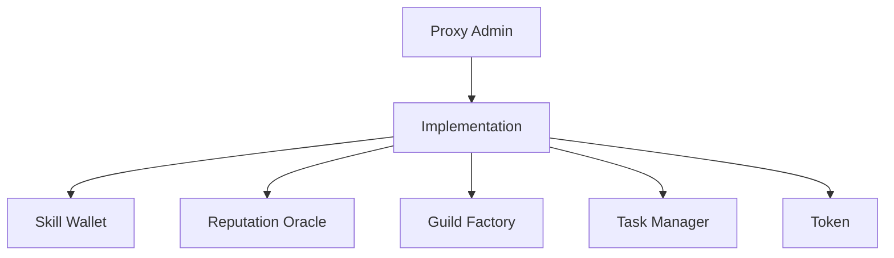

# 📝 Smart Contracts Development Guide

> 🔗 **Related**: See [Architecture Guide](../get-started/03-architecture.md) for system overview.

## Contract Architecture

### Core Contracts



## Development Environment

### Prerequisites
- Node.js v18+
- Hardhat
- OpenZeppelin Contracts
- Ethers.js
- TypeChain

### Setup
```bash
# Install dependencies
yarn add -D hardhat @openzeppelin/contracts @nomiclabs/hardhat-ethers
yarn add -D @typechain/hardhat typechain @typechain/ethers-v6

# Initialize Hardhat
npx hardhat init
```

### Project Structure
```
contracts/
├── core/           # Core protocol contracts
├── governance/     # DAO & voting contracts
├── interfaces/     # Contract interfaces
├── libraries/      # Shared libraries
└── test/          # Test contracts
```

## Core Contracts

### 1. Skill Wallet (ERC-721)
```solidity
// SPDX-License-Identifier: MIT
pragma solidity ^0.8.19;

import "@openzeppelin/contracts/token/ERC721/ERC721.sol";
import "@openzeppelin/contracts/security/Pausable.sol";
import "@openzeppelin/contracts/access/AccessControl.sol";

contract SkillWallet is ERC721, Pausable, AccessControl {
    bytes32 public constant MINTER_ROLE = keccak256("MINTER_ROLE");
    
    struct Skill {
        uint256 level;
        uint256 experience;
        uint256[] badges;
    }
    
    mapping(uint256 => Skill) public skills;
    
    constructor() ERC721("PHEME Skill Wallet", "SKILL") {
        _grantRole(DEFAULT_ADMIN_ROLE, msg.sender);
    }
    
    function mint(address to) public onlyRole(MINTER_ROLE) returns (uint256) {
        // Implementation
    }
    
    function addExperience(uint256 tokenId, uint256 amount) external {
        // Implementation
    }
}
```

### 2. Reputation Oracle
```solidity
contract ReputationOracle {
    struct Score {
        uint256 value;
        uint256 timestamp;
        address validator;
    }
    
    mapping(address => Score) public scores;
    
    function updateScore(address user, uint256 score) external {
        // Implementation
    }
    
    function getScore(address user) external view returns (uint256) {
        // Implementation
    }
}
```

### 3. Guild System
```solidity
contract GuildFactory {
    struct Guild {
        string name;
        address owner;
        uint256 memberCount;
        mapping(address => bool) members;
    }
    
    function createGuild(string memory name) external returns (uint256) {
        // Implementation
    }
    
    function joinGuild(uint256 guildId) external {
        // Implementation
    }
}
```

## Testing

### Unit Tests
```typescript
import { expect } from "chai";
import { ethers } from "hardhat";

describe("SkillWallet", function () {
    let skillWallet;
    let owner;
    let user;

    beforeEach(async function () {
        const SkillWallet = await ethers.getContractFactory("SkillWallet");
        [owner, user] = await ethers.getSigners();
        skillWallet = await SkillWallet.deploy();
        await skillWallet.deployed();
    });

    it("Should mint a new skill wallet", async function () {
        await skillWallet.connect(owner).mint(user.address);
        expect(await skillWallet.balanceOf(user.address)).to.equal(1);
    });
});
```

### Integration Tests
```typescript
describe("Integration", function () {
    it("Should integrate with Reputation Oracle", async function () {
        // Implementation
    });
});
```

## Deployment

### Local Development
```bash
# Start local node
npx hardhat node

# Deploy contracts
npx hardhat run scripts/deploy.ts --network localhost
```

### Testnet Deployment
```bash
# Deploy to Base Goerli
npx hardhat run scripts/deploy.ts --network base-goerli

# Verify contracts
npx hardhat verify --network base-goerli DEPLOYED_ADDRESS
```

## Security

### Best Practices
1. Use OpenZeppelin contracts
2. Implement access control
3. Add emergency pause
4. Include event emissions
5. Follow checks-effects-interactions

### Common Vulnerabilities
- Reentrancy
- Integer overflow/underflow
- Access control issues
- Front-running
- Gas limitations

## Gas Optimization

### Techniques
1. **Storage Optimization**
   - Pack variables
   - Use mappings over arrays
   - Implement batch operations

2. **Computation Optimization**
   - Cache storage variables
   - Minimize state changes
   - Use unchecked blocks

### Example
```solidity
contract GasOptimized {
    // Pack variables into same slot
    struct UserData {
        uint128 balance;
        uint64 lastUpdate;
        uint64 flags;
    }
    
    // Use mappings for O(1) access
    mapping(address => UserData) public userData;
    
    // Batch operations
    function batchUpdate(address[] calldata users) external {
        uint256 length = users.length;
        for (uint256 i = 0; i < length;) {
            // Update logic
            unchecked { ++i; }
        }
    }
}
```

## Upgradeability

### Proxy Pattern
```solidity
import "@openzeppelin/contracts/proxy/transparent/TransparentUpgradeableProxy.sol";

contract SkillWalletProxy is TransparentUpgradeableProxy {
    constructor(
        address logic,
        address admin,
        bytes memory data
    ) TransparentUpgradeableProxy(logic, admin, data) {}
}
```

### Implementation Contract
```solidity
import "@openzeppelin/contracts-upgradeable/proxy/utils/Initializable.sol";

contract SkillWalletV2 is Initializable {
    function initialize() public initializer {
        // Implementation
    }
    
    function newFeature() external {
        // New functionality
    }
}
```

## Events & Indexing

### Event Definition
```solidity
contract SkillWallet {
    event ExperienceGained(
        address indexed user,
        uint256 indexed tokenId,
        uint256 amount,
        uint256 timestamp
    );
    
    event BadgeAwarded(
        address indexed user,
        uint256 indexed tokenId,
        uint256 indexed badgeId,
        uint256 timestamp
    );
}
```

## Error Handling

### Custom Errors
```solidity
error InvalidLevel(uint256 current, uint256 required);
error InsufficientExperience(uint256 current, uint256 required);
error UnauthorizedAccess(address caller, address required);

contract SkillWallet {
    function levelUp(uint256 tokenId) external {
        if (msg.sender != ownerOf(tokenId))
            revert UnauthorizedAccess(msg.sender, ownerOf(tokenId));
            
        Skill storage skill = skills[tokenId];
        if (skill.experience < requiredExperience(skill.level))
            revert InsufficientExperience(skill.experience, requiredExperience(skill.level));
            
        skill.level++;
    }
}
```

## Development Tools

### Hardhat Tasks
```typescript
task("mint", "Mints a new skill wallet")
    .addParam("address", "The address to mint to")
    .setAction(async (taskArgs, hre) => {
        const SkillWallet = await hre.ethers.getContractFactory("SkillWallet");
        const skillWallet = SkillWallet.attach(DEPLOYED_ADDRESS);
        await skillWallet.mint(taskArgs.address);
    });
```

## Resources

### Documentation
- [Solidity Documentation](https://docs.soliditylang.org/)
- [OpenZeppelin Docs](https://docs.openzeppelin.com/)
- [Hardhat Documentation](https://hardhat.org/getting-started/)

### Tools
- [Remix IDE](https://remix.ethereum.org/)
- [Tenderly](https://tenderly.co/)
- [Etherscan](https://etherscan.io/)

> 🔒 **Security**: Review our [Security Guidelines](../technical/05-security.md) for smart contract security best practices.
