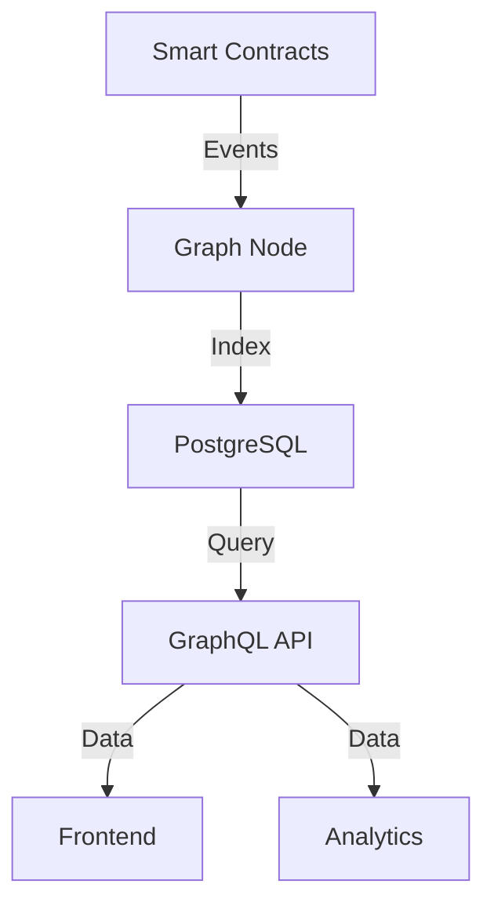

# 📊 Subgraph Development Guide

> 🔗 **Related**: See [Smart Contracts](01-smart-contracts.md) for contract integration.

## Overview

The AURA Protocol subgraph indexes blockchain data for efficient querying and analytics. It tracks skill wallets, reputation scores, guild activities, and task completions.

### Architecture


## Development Setup

### Prerequisites
- Node.js v18+
- Graph CLI
- PostgreSQL
- IPFS (optional)

### Installation
```bash
# Install Graph CLI
npm install -g @graphprotocol/graph-cli

# Initialize subgraph
graph init --from-contract <CONTRACT_ADDRESS> \
  --network base \
  --contract-name SkillWallet \
  --index-events

# Install dependencies
yarn install
```

## Schema Definition

### Entity Schema
```graphql
type SkillWallet @entity {
  id: ID!
  owner: Bytes!
  level: Int!
  experience: BigInt!
  badges: [Badge!]! @derivedFrom(field: "wallet")
  createdAt: BigInt!
  updatedAt: BigInt!
}

type Badge @entity {
  id: ID!
  wallet: SkillWallet!
  badgeType: String!
  awardedAt: BigInt!
  metadata: String
}

type ReputationScore @entity {
  id: ID!
  user: Bytes!
  score: BigInt!
  validator: Bytes!
  timestamp: BigInt!
}

type Guild @entity {
  id: ID!
  name: String!
  owner: Bytes!
  members: [GuildMember!]! @derivedFrom(field: "guild")
  tasks: [Task!]! @derivedFrom(field: "guild")
  createdAt: BigInt!
}

type GuildMember @entity {
  id: ID!
  guild: Guild!
  member: Bytes!
  joinedAt: BigInt!
}

type Task @entity {
  id: ID!
  guild: Guild
  creator: Bytes!
  assignee: Bytes
  status: String!
  reward: BigInt!
  completedAt: BigInt
  createdAt: BigInt!
}
```

## Event Handling

### Event Mappings
```typescript
import { SkillWalletMinted, ExperienceGained } from '../generated/SkillWallet/SkillWallet'
import { SkillWallet } from '../generated/schema'

export function handleSkillWalletMinted(event: SkillWalletMinted): void {
  let wallet = new SkillWallet(event.params.tokenId.toString())
  wallet.owner = event.params.owner
  wallet.level = 1
  wallet.experience = BigInt.fromI32(0)
  wallet.createdAt = event.block.timestamp
  wallet.updatedAt = event.block.timestamp
  wallet.save()
}

export function handleExperienceGained(event: ExperienceGained): void {
  let wallet = SkillWallet.load(event.params.tokenId.toString())
  if (wallet) {
    wallet.experience = wallet.experience.plus(event.params.amount)
    wallet.updatedAt = event.block.timestamp
    wallet.save()
  }
}
```

### Subgraph Manifest
```yaml
specVersion: 0.0.4
schema:
  file: ./schema.graphql
dataSources:
  - kind: ethereum/contract
    name: SkillWallet
    network: base
    source:
      address: "0x..."
      abi: SkillWallet
      startBlock: 1234567
    mapping:
      kind: ethereum/events
      apiVersion: 0.0.6
      language: wasm/assemblyscript
      entities:
        - SkillWallet
        - Badge
      abis:
        - name: SkillWallet
          file: ./abis/SkillWallet.json
      eventHandlers:
        - event: SkillWalletMinted(indexed address,indexed uint256)
          handler: handleSkillWalletMinted
        - event: ExperienceGained(indexed uint256,uint256)
          handler: handleExperienceGained
      file: ./src/mapping.ts
```

## Query Examples

### Skill Wallet Queries
```graphql
query GetUserWallets($owner: Bytes!) {
  skillWallets(where: { owner: $owner }) {
    id
    level
    experience
    badges {
      badgeType
      awardedAt
    }
    createdAt
  }
}

query GetHighLevelWallets {
  skillWallets(
    where: { level_gt: 10 }
    orderBy: experience
    orderDirection: desc
    first: 10
  ) {
    id
    owner
    level
    experience
  }
}
```

### Guild Analytics
```graphql
query GuildStats($guildId: ID!) {
  guild(id: $guildId) {
    name
    members {
      member
      joinedAt
    }
    tasks(where: { status: "completed" }) {
      reward
      completedAt
    }
  }
}
```

## Deployment

### Local Development
```bash
# Generate types
yarn codegen

# Create local node
yarn graph-node

# Deploy locally
yarn create-local
yarn deploy-local
```

### Production Deployment
```bash
# Authenticate (if using hosted service)
graph auth https://api.thegraph.com/deploy/ <ACCESS_TOKEN>

# Deploy to production
yarn deploy
```

## Testing

### Unit Tests
```typescript
import { assert, describe, test, clearStore } from "matchstick-as/assembly/index"
import { handleSkillWalletMinted } from "../src/mapping"

describe("SkillWallet", () => {
  test("Minting creates wallet entity", () => {
    let tokenId = "1234"
    let owner = "0x..."
    
    // Create mock event
    let newMintEvent = createSkillWalletMintedEvent(tokenId, owner)
    
    // Handle event
    handleSkillWalletMinted(newMintEvent)
    
    // Assert entity created
    assert.entityCount("SkillWallet", 1)
    
    // Assert fields
    assert.fieldEquals("SkillWallet", tokenId, "owner", owner)
    assert.fieldEquals("SkillWallet", tokenId, "level", "1")
  })
})
```

## Performance Optimization

### Indexing Optimization
1. **Start Block Selection**
   - Choose appropriate start block
   - Consider historical data needs
   - Balance sync time vs data needs

2. **Entity Relations**
   - Use efficient relationships
   - Implement derived fields
   - Optimize nested queries

3. **Caching Strategy**
   - Cache common queries
   - Use field-level caching
   - Implement result pagination

## Monitoring

### Health Checks
```graphql
query SubgraphHealth {
  _meta {
    block {
      number
      hash
    }
    deployment
    hasIndexingErrors
  }
}
```

### Performance Metrics
- Indexing speed
- Query response time
- Error rates
- Sync status

## Error Handling

### Common Issues
1. **Indexing Errors**
   - Missing events
   - Invalid handlers
   - Schema mismatches

2. **Query Errors**
   - Timeout issues
   - Rate limiting
   - Invalid syntax

### Error Recovery
```typescript
export function handleComplexEvent(event: ComplexEvent): void {
  try {
    // Handle event
  } catch (error) {
    log.error(
      'Error processing event {} at block {}. Error: {}',
      [event.transaction.hash.toHex(), event.block.number.toString(), error]
    )
  }
}
```

## Resources

### Documentation
- [The Graph Documentation](https://thegraph.com/docs/)
- [AssemblyScript Documentation](https://www.assemblyscript.org/)
- [GraphQL Documentation](https://graphql.org/learn/)

### Tools
- [Graph Explorer](https://thegraph.com/explorer/)
- [GraphiQL](https://github.com/graphql/graphiql)
- [Graph CLI](https://github.com/graphprotocol/graph-cli)

> 📈 **Analytics**: See [Analytics Guide](../technical/40-analytics.md) for data analysis examples.
