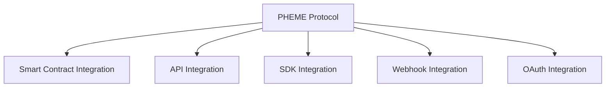

# 🔌 Integration Guide

> 🔗 **Related**: See [API Specification](03-api-spec.md) for API details.

## Overview

PHEME Protocol provides multiple integration points for third-party applications, platforms, and services. This guide covers integration patterns, SDKs, and best practices.

### Integration Types


## SDK Integration

### JavaScript/TypeScript SDK
```typescript
import { PhemeSDK } from '@pheme/sdk';

const pheme = new PhemeSDK({
    apiKey: 'your-api-key',
    environment: 'production',
    network: 'base'
});

// Initialize wallet connection
await pheme.connect();

// Get user's skill wallet
const wallet = await pheme.getSkillWallet(address);

// Create task
const task = await pheme.createTask({
    title: 'Implement Feature',
    description: 'Add new functionality',
    reward: '100'
});
```

### Python SDK
```python
from pheme_sdk import PhemeSDK

pheme = PhemeSDK(
    api_key='your-api-key',
    environment='production',
    network='base'
)

# Get user's reputation
reputation = pheme.get_reputation(address)

# Join guild
guild = pheme.join_guild(guild_id)
```

## Smart Contract Integration

### Contract Interfaces
```solidity
interface ISkillWallet {
    function mint(address to) external returns (uint256);
    function getLevel(uint256 tokenId) external view returns (uint256);
    function addExperience(uint256 tokenId, uint256 amount) external;
}

interface IReputationOracle {
    function getScore(address user) external view returns (uint256);
    function updateScore(address user, uint256 score) external;
}
```

### Integration Example
```solidity
contract GameIntegration {
    ISkillWallet public skillWallet;
    IReputationOracle public reputationOracle;
    
    constructor(address _skillWallet, address _reputationOracle) {
        skillWallet = ISkillWallet(_skillWallet);
        reputationOracle = IReputationOracle(_reputationOracle);
    }
    
    function onGameComplete(address player, uint256 score) external {
        uint256 tokenId = skillWallet.getTokenId(player);
        skillWallet.addExperience(tokenId, score);
        reputationOracle.updateScore(player, score);
    }
}
```

## API Integration

### REST API Example
```typescript
// Authentication
const auth = await fetch('https://api.aphemeai.xyz/auth/challenge', {
    method: 'POST',
    headers: { 'Content-Type': 'application/json' },
    body: JSON.stringify({ address })
});

// Get user profile
const profile = await fetch('https://api.phemeai.xyz/api/v1/users/me', {
    headers: {
        'Authorization': `Bearer ${token}`,
        'Content-Type': 'application/json'
    }
});

// Create task
const task = await fetch('https://api.phemeai.xyz/api/v1/tasks', {
    method: 'POST',
    headers: {
        'Authorization': `Bearer ${token}`,
        'Content-Type': 'application/json'
    },
    body: JSON.stringify({
        title: 'Task Title',
        description: 'Task Description',
        reward: '100'
    })
});
```

### GraphQL API Example
```typescript
const GET_PROFILE = gql`
    query GetProfile($address: String!) {
        profile(address: $address) {
            skillWallet {
                level
                experience
                badges {
                    type
                    awardedAt
                }
            }
            reputation {
                score
                lastUpdate
            }
            guilds {
                name
                role
            }
        }
    }
`;

const { data } = await client.query({
    query: GET_PROFILE,
    variables: { address }
});
```

## Webhook Integration

### Webhook Configuration
```typescript
interface WebhookConfig {
    url: string;
    secret: string;
    events: string[];
    retries: number;
    timeout: number;
}

const config: WebhookConfig = {
    url: 'https://your-app.com/webhooks/pheme',
    secret: 'your-webhook-secret',
    events: [
        'task.completed',
        'experience.gained',
        'badge.awarded'
    ],
    retries: 3,
    timeout: 5000
};
```

### Webhook Handler
```typescript
import crypto from 'crypto';
import express from 'express';

const app = express();

app.post('/webhooks/pheme', express.json(), (req, res) => {
    // Verify signature
    const signature = req.headers['x-pheme-signature'];
    const isValid = verifySignature(req.body, signature, WEBHOOK_SECRET);
    
    if (!isValid) {
        return res.status(401).json({ error: 'Invalid signature' });
    }
    
    // Handle webhook
    const { event, data } = req.body;
    
    switch (event) {
        case 'task.completed':
            handleTaskCompletion(data);
            break;
        case 'experience.gained':
            handleExperienceGain(data);
            break;
        case 'badge.awarded':
            handleBadgeAward(data);
            break;
    }
    
    res.json({ received: true });
});
```

## OAuth Integration

### OAuth Flow
```typescript
// 1. Redirect to PHEME OAuth
const authUrl = `https://auth.phemeai.xyz/oauth/authorize?
    client_id=${CLIENT_ID}&
    redirect_uri=${REDIRECT_URI}&
    scope=profile,wallet,tasks&
    response_type=code`;

// 2. Handle callback
app.get('/oauth/callback', async (req, res) => {
    const { code } = req.query;
    
    // Exchange code for tokens
    const tokens = await fetch('https://auth.phemeai.xyz/oauth/token', {
        method: 'POST',
        headers: { 'Content-Type': 'application/json' },
        body: JSON.stringify({
            client_id: CLIENT_ID,
            client_secret: CLIENT_SECRET,
            code,
            grant_type: 'authorization_code'
        })
    });
    
    // Store tokens
    const { access_token, refresh_token } = await tokens.json();
    // ...
});
```

### OAuth Scopes
| Scope | Description |
|-------|-------------|
| `profile` | Read user profile |
| `wallet` | Access skill wallet |
| `tasks` | Manage tasks |
| `guilds` | Guild operations |
| `reputation` | Read reputation |

## Event Integration

### WebSocket Events
```typescript
const ws = new WebSocket('wss://api.phemeai.xyz/ws');

ws.onmessage = (event) => {
    const { type, data } = JSON.parse(event.data);
    
    switch (type) {
        case 'task.created':
            handleNewTask(data);
            break;
        case 'guild.member.joined':
            handleNewMember(data);
            break;
    }
};
```

### Event Subscriptions
```graphql
subscription OnTaskCompleted {
    taskCompleted {
        id
        title
        completedBy {
            address
            reputation
        }
        reward
        completedAt
    }
}
```

## Data Integration

### Data Export
```typescript
// Export user data
const userData = await pheme.exportUserData(address, {
    format: 'json',
    include: ['profile', 'tasks', 'badges']
});

// Export analytics
const analytics = await pheme.exportAnalytics({
    startDate: '2024-01-01',
    endDate: '2024-03-31',
    metrics: ['taskCompletion', 'reputationGrowth']
});
```

### Data Import
```typescript
// Import historical data
await pheme.importData({
    users: userData,
    tasks: taskData,
    validations: validationData
});

// Sync external achievements
await pheme.syncAchievements(address, {
    platform: 'github',
    achievements: githubAchievements
});
```

## Security

### Best Practices
1. **API Security**
   - Use HTTPS only
   - Implement rate limiting
   - Validate all inputs
   - Secure API keys

2. **Webhook Security**
   - Verify signatures
   - Use HTTPS endpoints
   - Implement retry logic
   - Monitor failures

3. **OAuth Security**
   - Use state parameter
   - Validate redirect URIs
   - Secure client secrets
   - Implement PKCE

### Example: Signature Verification
```typescript
function verifySignature(payload: any, signature: string, secret: string): boolean {
    const hmac = crypto.createHmac('sha256', secret);
    const digest = hmac.update(JSON.stringify(payload)).digest('hex');
    return crypto.timingSafeEqual(
        Buffer.from(signature),
        Buffer.from(digest)
    );
}
```

## Testing

### Integration Tests
```typescript
describe('PHEME Integration', () => {
    it('should integrate with skill wallet', async () => {
        const pheme = new PhemeSDK(config);
        const wallet = await pheme.getSkillWallet(address);
        
        expect(wallet.level).toBeGreaterThan(0);
        expect(wallet.experience).toBeDefined();
    });
});
```

### Webhook Tests
```typescript
describe('Webhook Handler', () => {
    it('should verify webhook signature', () => {
        const payload = { event: 'task.completed' };
        const signature = createSignature(payload, secret);
        
        expect(verifySignature(payload, signature, secret)).toBe(true);
    });
});
```

## Resources

### Documentation
- [API Documentation](https://docs.phemeai.xyz/api)
- [SDK Documentation](https://docs.phemeai.xyz/sdk)
- [Integration Examples](https://github.com/pheme-protocol/integration-examples)

### Tools
- [Integration Dashboard](https://dashboard.phemeai.xyz/integrations)
- [Webhook Tester](https://webhook.phemeai.xyz)
- [OAuth Playground](https://oauth.phemeai.xyz)

> 🔒 **Security**: Review our [Security Guidelines](../technical/05-security.md) for integration security best practices.
