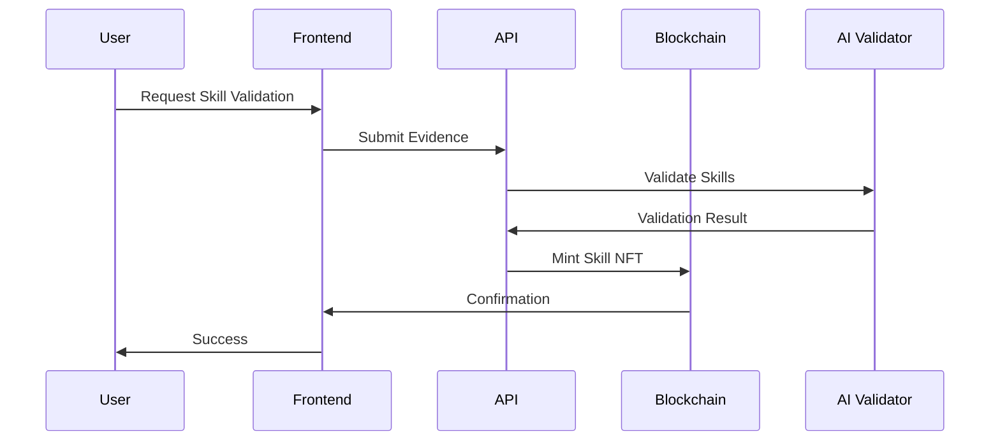
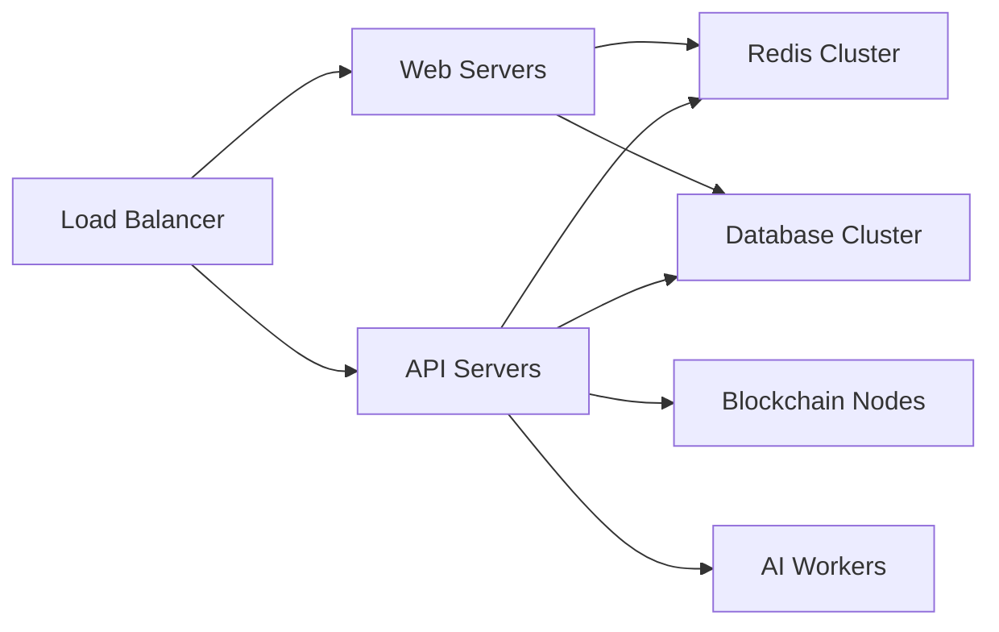
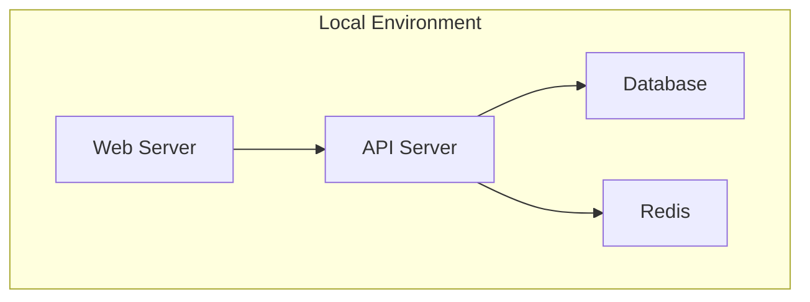

# 🏗️ Architecture Overview


This guide provides a comprehensive overview of the PhemeAI architecture, including system components, data flow, and technical specifications.


## System Architecture



```mermaid
graph TB
    A[Web Interface] --> B[API Gateway]
    B --> C[Core Services]
    C --> D[Blockchain Layer]
    C --> E[AI Layer]
    
    subgraph Core Services
    F[Skill Validation]
    G[Reputation Oracle]
    H[Token Management]
    end
    
    subgraph Data Layer
    I[PostgreSQL]
    J[Redis Cache]
    K[IPFS Storage]
    end
    
    C --> Data Layer
```











## Core Components



### Frontend Architecture

- **Framework**: Next.js
- **State Management**: Redux Toolkit
- **Styling**: Tailwind CSS
- **Web3 Integration**: ethers.js

```typescript
// Example component structure
import { useSkillValidation } from '@pheme-protocol/hooks';

const SkillValidator = () => {
  const { validate, loading } = useSkillValidation();
  // Component logic
};
```



### API Architecture

- **Framework**: Node.js + Express
- **API Style**: REST + GraphQL
- **Authentication**: JWT + Web3
- **Caching**: Redis

```typescript
// Example API endpoint
app.post('/api/skills/validate', async (req, res) => {
  const { skill, evidence } = req.body;
  const result = await skillValidator.validate(skill, evidence);
  res.json(result);
});
```



### AI Architecture

- **Framework**: Python + FastAPI
- **Models**: GPT-4 + Custom Models
- **Validation Logic**: Multi-stage pipeline
- **Scaling**: Kubernetes

```python
# Example validation pipeline
async def validate_skill(skill: Skill, evidence: Evidence):
    # Validation logic
    return ValidationResult
```



### Blockchain Architecture

- **Network**: Base (Ethereum L2)
- **Contracts**: Solidity + Hardhat
- **Standards**: ERC-721, ERC-20
- **Indexing**: The Graph

```solidity
// Example smart contract
contract SkillNFT is ERC721 {
    function mint(address to, uint256 tokenId) external {
        // Minting logic
    }
}
```



## Technical Specifications



### Performance Requirements

| Metric | Target |
|--------|--------|
| API Response Time | < 200ms |
| Blockchain Confirmation | < 5s |
| AI Validation Time | < 30s |
| Concurrent Users | 10,000+ |


These metrics are monitored using Prometheus and Grafana.




### Security Measures

1. **Smart Contract Security**
   - Audited by leading firms
   - Multi-sig governance
   - Upgradeable contracts

2. **API Security**
   - Rate limiting
   - JWT authentication
   - DDOS protection

3. **Data Security**
   - Encrypted at rest
   - Regular backups
   - Access control



### Scaling Strategy

1. **Horizontal Scaling**
   - Kubernetes clusters
   - Database sharding
   - Load balancing

2. **Vertical Scaling**
   - High-performance instances
   - Optimized caching
   - Efficient indexing

3. **Layer 2 Scaling**
   - Base network integration
   - Optimistic rollups
   - Fast finality



## Integration Points



### REST API

```bash
# Base URL
https://api.phemeai.xyz/v1

# Authentication
Authorization: Bearer <jwt_token>

# Example endpoints
GET /skills
POST /skills/validate
GET /reputation/:address
```

### GraphQL API

```graphql
query GetSkills($address: String!) {
  skills(address: $address) {
    id
    name
    level
    validation {
      status
      timestamp
    }
  }
}
```



### JavaScript/TypeScript SDK

```typescript
import { PhemeSDK } from '@pheme-protocol/sdk';

const pheme = new PhemeSDK({
  apiKey: 'your-api-key',
  network: 'mainnet'
});

// Example usage
await pheme.skills.validate({
  skill: 'javascript',
  evidence: 'https://github.com/user/project'
});
```



### Contract Addresses

| Network | Contract | Address |
|---------|----------|---------|
| Base Mainnet | SkillNFT | 0x... |
| Base Mainnet | Reputation | 0x... |
| Base Testnet | SkillNFT | 0x... |
| Base Testnet | Reputation | 0x... |

### Contract Interfaces

```solidity
interface ISkillNFT {
    function mint(address to, uint256 tokenId) external;
    function validate(uint256 tokenId, bytes calldata proof) external;
    function getSkill(uint256 tokenId) external view returns (Skill memory);
}
```



## Deployment Architecture



```mermaid
graph TB
    subgraph Cloud Infrastructure
        LB[Load Balancer]
        subgraph Web Tier
            W1[Web Server 1]
            W2[Web Server 2]
        end
        subgraph API Tier
            A1[API Server 1]
            A2[API Server 2]
        end
        subgraph Data Tier
            D1[Primary DB]
            D2[Replica DB]
            R1[Redis Primary]
            R2[Redis Replica]
        end
    end
    
    LB --> Web Tier
    LB --> API Tier
    Web Tier --> API Tier
    API Tier --> Data Tier
```







## Monitoring & Maintenance



### Metrics Collection

- Prometheus for metrics
- Grafana for visualization
- ELK Stack for logs
- Alertmanager for notifications

### Key Metrics

| Category | Metrics |
|----------|---------|
| System | CPU, Memory, Disk |
| Application | Response Time, Error Rate |
| Blockchain | Gas Usage, Transaction Time |
| Business | Active Users, Validations |



### Routine Tasks

1. Database Maintenance
   - Weekly backups
   - Monthly optimization
   - Quarterly cleanup

2. Security Updates
   - Daily vulnerability scans
   - Weekly dependency updates
   - Monthly security audits

3. Performance Optimization
   - Cache warming
   - Query optimization
   - Contract gas optimization



## Next Steps


Ready to start building?
* [💻 Developer Setup](../developer-guide/00-development-setup.md)
* [📚 API Documentation](../developer-guide/07-api-reference.md)
* [🔗 Smart Contracts](../developer-guide/01-smart-contracts.md)



Need technical support? Check our [Developer Discord](coming soon)!

