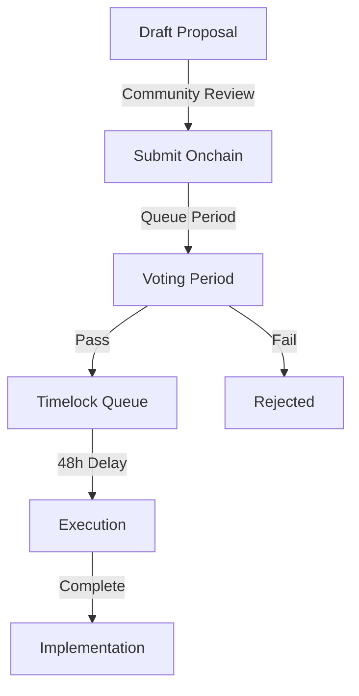

# Governance Model

> 📚 **Related**: See [Token Economics](01-tokenomics.md) for detailed token distribution and utility.

## Overview

PHEME Protocol implements a merit-based governance system that combines token holdings with skill reputation to ensure both economic and contribution-based representation in decision-making.

### Core Components

* **Governance Token:** `$PHEME` (ERC-20)
* **Merit System:** Reputation Oracle scores (0-100)
* **Smart Contracts:** OpenZeppelin Governor + Timelock + Treasury
* **Voting Interface:** Snapshot + Custom UI

> 🔒 **Security**: Review our [Security Model](03-security-model.md) for governance safeguards.

## Governance Structure

### Key Roles

| Role               | Responsibilities                                                                         | Requirements        |
| ------------------ | ---------------------------------------------------------------------------------------- | ------------------- |
| Token Holders      | <p>- Submit proposals<br>- Vote on changes<br>- Control treasury</p>                     | Hold minimum tokens |
| Reputation Oracles | <p>- Provide skill scores<br>- Validate contributions<br>- Update multipliers</p>        | Selected by DAO     |
| Proposal Council   | <p>- Review complex proposals<br>- Provide recommendations<br>- Technical assessment</p> | Elected quarterly   |
| Timelock Admin     | <p>- Execute approved changes<br>- Manage delay periods<br>- Emergency response</p>      | Multi-sig control   |
| Treasury Multi-sig | <p>- Manage DAO funds<br>- Execute payments<br>- Asset management</p>                    | 5-of-7 signers      |

> 🤝 **Community**: See [Community Guide](../overview/04-community-guides.md) for participation details.

## Proposal Process



### 1. Proposal Creation

* Minimum token requirement: 0.1% of supply
* Required components:
  * Title and summary
  * Technical specification
  * Implementation plan
  * Risk assessment
  * Rollback procedure

### 2. Voting Mechanics

* Duration: 7 days
* Options: For, Against, Abstain
* Quorum: 4% of total voting power
*   Vote weight calculation:

    ```solidity
    votePower = tokenBalance * (1 + (repScore/100) * maxMultiplier)
    ```

### 3. Execution Process

* 48-hour timelock delay
* Multi-sig confirmation
* Automated execution
* Result verification

> ⚙️ **Technical**: Check [Smart Contracts](../technical/01-tech-stack.md) for implementation details.

## Voting Power Calculation

### Merit Multiplier System

```typescript
interface MeritMultiplier {
    baseVotingPower: number;    // Token balance
    repScore: number;           // 0-100 from Oracle
    maxMultiplier: number;      // Default 0.5 (50%)
    
    calculateVotePower(): number {
        return baseVotingPower * (1 + (repScore/100) * maxMultiplier);
    }
}
```

### Example Scenarios

| Tokens | Rep Score | Multiplier | Final Vote Power |
| ------ | --------- | ---------- | ---------------- |
| 1000   | 0         | 1.0x       | 1000             |
| 1000   | 50        | 1.25x      | 1250             |
| 1000   | 100       | 1.5x       | 1500             |

> 📊 **Analytics**: See [Reputation Oracle](../technical/02-architecture.md) for scoring details.

## Governance Parameters

| Parameter          | Value       | Description                      |
| ------------------ | ----------- | -------------------------------- |
| Voting Delay       | 1 block     | Time between proposal and voting |
| Voting Period      | 7 days      | Duration of voting window        |
| Proposal Threshold | 0.1% supply | Minimum tokens to propose        |
| Quorum             | 4%          | Minimum participation required   |
| Timelock           | 48 hours    | Delay before execution           |
| Max Multiplier     | 0.5         | Maximum reputation bonus         |

## Treasury Management

### Access Control

* 5-of-7 multi-sig requirement
* Quarterly rotation of signers
* Transparent transaction history
* Regular financial reporting

### Spending Limits

* Single proposal: Max 10% of treasury
* Annual budget allocation
* Emergency fund reserve
* Grant program allocation

> 💰 **Economics**: Review [Token Economics](01-tokenomics.md) for treasury allocation.

## Security Measures

### Risk Mitigation

* Timelock delays
* Multi-sig requirements
* Emergency pause functionality
* Regular security audits
* Bug bounty program

### Dispute Resolution

1. Technical failures
   * Gas optimization
   * Contract debugging
   * Resubmission process
2. Community conflicts
   * Forum discussion
   * Mediation process
   * Counter-proposals

> 🛡️ **Protection**: See [Security Model](03-security-model.md) for complete safeguards.

## Best Practices

### Proposal Guidelines

* Clear objectives
* Technical specifications
* Impact assessment
* Risk analysis
* Implementation timeline
* Testing results

### Voting Recommendations

* Review documentation
* Assess implications
* Consider alternatives
* Evaluate risks
* Check dependencies

## Resources

### Official Channels

* [Snapshot Space](https://snapshot.org/#/aurabot.eth)
* [Forum](https://discourse.aurabot.xyz/c/governance)
* [Github](https://github.com/autonomous-aura/governance)

### Documentation

* [Technical Specs](../technical/02-architecture.md)
* [API Reference](../technical/30-api-reference.md)
* [Smart Contracts](../developer-guide/01-smart-contracts.md)

### Tools

* Governance Dashboard
* Proposal Calculator
* Vote Weight Simulator
* Treasury Explorer

## Updates & Maintenance

The governance model is subject to continuous improvement through:

* Community feedback
* Technical upgrades
* Security enhancements
* Parameter optimization
* Process refinement

> 🔄 **Changes**: Follow our [Version Management](../technical/53-versioning.md) for updates.
