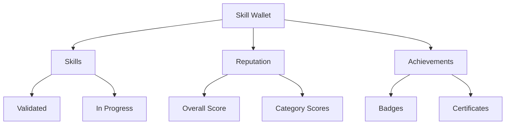
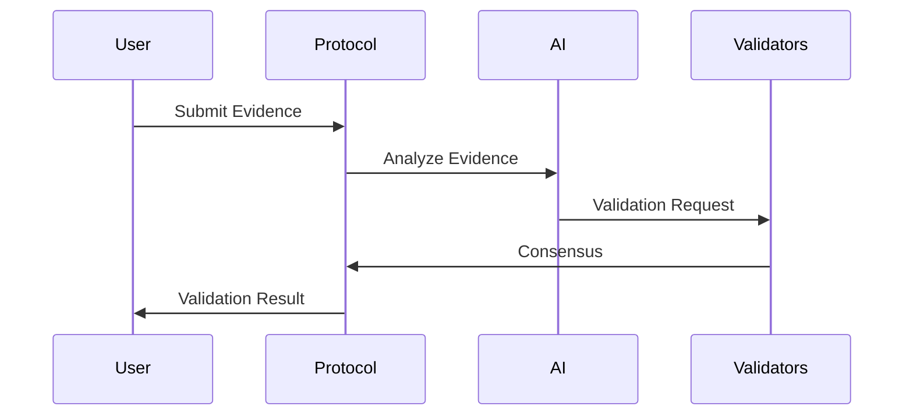
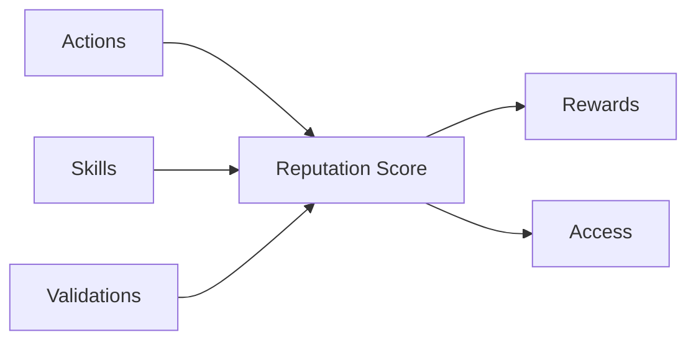

# 🔑 Key Concepts


This guide explains the core concepts and components of the Pheme AI. Understanding these concepts is essential for both users and developers.


## Core Components



A digital identity container that holds validated skills, reputation scores, and achievements.




Your Skill Wallet is soulbound (non-transferable) and represents your unique identity in the Pheme ecosystem.




AI-powered system for validating and verifying user skills.




Evidence must be verifiable and meet our quality standards for successful validation.




A merit-based scoring system that reflects user contributions and validated skills.




Higher reputation scores unlock additional features and opportunities in the ecosystem.




## Skill Categories



### Development Skills
- Programming Languages
- Frameworks & Libraries
- System Architecture
- DevOps & Infrastructure

### Validation Criteria
```typescript
interface TechnicalValidation {
  codeQuality: "Code review and best practices",
  systemDesign: "Architecture and scalability",
  problemSolving: "Algorithm and solution efficiency",
  documentation: "Code documentation and clarity"
}
```



### Creative Areas
- UI/UX Design
- Graphic Design
- Content Creation
- Digital Art

### Validation Criteria
```typescript
interface CreativeValidation {
  design: "Visual appeal and consistency",
  userExperience: "Usability and interaction",
  innovation: "Creativity and originality",
  execution: "Technical implementation"
}
```



### Business Areas
- Project Management
- Marketing
- Business Development
- Finance

### Validation Criteria
```typescript
interface BusinessValidation {
  strategy: "Planning and execution",
  results: "Measurable outcomes",
  leadership: "Team management",
  innovation: "Market approach"
}
```



## Validation Process



### Evidence Requirements

| Type | Examples | Format |
|------|----------|---------|
| Code | GitHub repos, PRs | Link + Description |
| Design | Portfolio, Projects | Images + Context |
| Business | Case Studies | Document + Metrics |


All submissions should include context and measurable outcomes.




### Validation Steps

1. **AI Analysis**
   - Code review
   - Pattern recognition
   - Quality assessment

2. **Validator Review**
   - Expert verification
   - Consensus building
   - Final approval


Multiple validators must reach consensus for approval.




### Outcomes

| Result | Description | Next Steps |
|--------|-------------|------------|
| Approved | Skill validated | Receive NFT |
| Pending | Under review | Wait for validation |
| Rejected | Did not meet criteria | Improve and resubmit |


Approved skills are permanently recorded on-chain.




## Reputation Mechanics



### Reputation Formula

```typescript
interface ReputationScore {
  base: number;        // Base score from validations
  multiplier: number;  // Activity multiplier
  bonus: number;       // Special achievements
  decay: number;       // Time-based decay
}

totalScore = (base * multiplier + bonus) * (1 - decay)
```

### Score Components
- Validated skills
- Community contributions
- Task completion
- Peer endorsements



### Experience System

| Level | XP Required | Benefits |
|-------|-------------|----------|
| Novice | 0 - 1000 | Basic access |
| Advanced | 1001 - 5000 | Enhanced features |
| Expert | 5001 - 10000 | Special privileges |
| Master | 10000+ | Full benefits |

### Achievement Types
- Skill milestones
- Contribution streaks
- Community recognition
- Special events



### Reward Types

1. **Token Rewards**
   - Validation rewards
   - Contribution bonuses
   - Staking returns

2. **Non-Token Rewards**
   - Special badges
   - Access rights
   - Governance power
   - Premium features



## Governance Participation



### Voting Power

```typescript
votingPower = tokenBalance * (1 + reputationScore/100)
```


Higher reputation scores amplify your voting power.




### Proposal Types

- Protocol upgrades
- Parameter changes
- Feature requests
- Fund allocation


Proposals require minimum token holdings and reputation.




### Treasury Management

- Development funding
- Reward distribution
- Protocol maintenance
- Community initiatives


Treasury decisions require community approval.




## Next Steps


Ready to dive deeper?
* [🚀 Quick Start Guide](../get-started/01-quickstart.md)
* [📖 Developer Guide](../developer-guide/00-development-setup.md)
* [🤝 Community Guide](04-community-guides.md)



Need help understanding these concepts? Join our [Discord community](coming soon)!

