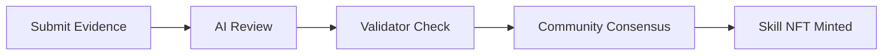
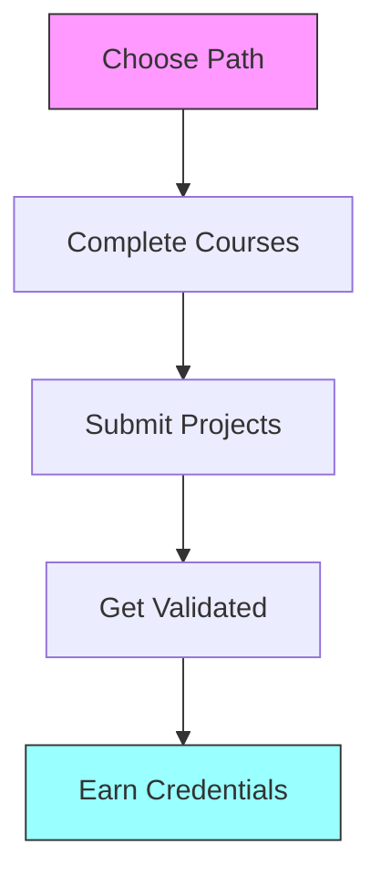
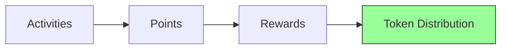

# 👥 Community Guides


Welcome to the PhemeAI community! This guide will help you understand how to participate, contribute, and grow within our ecosystem.


## Getting Started



### First Steps

1. **Create Your Identity**
   * Install MetaMask wallet
   * Connect to Base network
   * Mint your Skill Wallet

2. **Complete Onboarding**
   * Verify your email
   * Set up your profile
   * Choose skill categories


Join our [Discord](coming soon) to connect with other members and get help with onboarding.




### Validation Process




Ensure your evidence is well-documented and verifiable for faster validation.




### Progress Tracking

| Level | Requirements | Rewards |
|-------|--------------|---------|
| Novice | Complete onboarding | Basic access |
| Explorer | 3 validated skills | Enhanced features |
| Builder | 5 contributions | Special badge |
| Expert | 10 validations | Governance rights |


Track your progress in the [Pheme Dashboard](https://app.phemeai.xyz/dashboard).




## Contribution Paths



### Development Opportunities

1. **Code Contributions**
   ```typescript
   // Example contribution areas
   interface TechContributions {
     smartContracts: "Solidity development",
     frontend: "React/Next.js components",
     backend: "Node.js services",
     testing: "Unit/Integration tests"
   }
   ```

2. **Technical Documentation**
   * API documentation
   * Integration guides
   * Technical tutorials
   * Architecture diagrams

3. **Code Review**
   * Pull request reviews
   * Security audits
   * Performance optimization
   * Best practices guidance



### Design & Content

1. **Design Work**
   * UI/UX improvements
   * Visual assets
   * Brand materials
   * Infographics

2. **Content Creation**
   * Blog posts
   * Video tutorials
   * Social media content
   * Educational materials

3. **Community Resources**
   * Onboarding guides
   * User tutorials
   * Feature demonstrations
   * Case studies



### Support Activities

1. **Member Support**
   * Welcome new members
   * Answer questions
   * Provide guidance
   * Share resources

2. **Event Organization**
   * Community calls
   * Workshop sessions
   * AMA sessions
   * Hackathons

3. **Governance Participation**
   * Proposal reviews
   * Voting participation
   * Discussion moderation
   * Feedback collection



## Community Programs



### Skill Development



1. **Available Tracks**
   * Blockchain Development
   * Frontend Development
   * Smart Contract Security
   * Protocol Design

2. **Learning Resources**
   * Interactive tutorials
   * Video courses
   * Practice exercises
   * Mentorship sessions


Track your learning progress in your Skill Wallet.




### Project Development

1. **Project Categories**
   * Protocol integrations
   * Tool development
   * Documentation
   * Community resources

2. **Support Provided**
   * Technical mentorship
   * Resource allocation
   * Project funding
   * Marketing support


Successful projects receive additional token rewards and recognition.




### Mentorship Opportunities

1. **Mentor Roles**
   * Technical guidance
   * Project review
   * Career advice
   * Skill validation

2. **Requirements**
   * Expert level skills
   * Active participation
   * Good standing
   * Teaching ability


Mentors earn additional reputation points and rewards.




## Community Events



### Weekly Events

| Day | Event | Description |
|-----|-------|-------------|
| Monday | Community Call | Updates & discussions |
| Wednesday | Technical Workshop | Hands-on learning |
| Friday | AMA Session | Q&A with team |

### Monthly Events
* Hackathons
* Skill Workshops
* Governance Meetings
* Social Gatherings



### Seasonal Competitions

1. **Skill Challenges**
   * Coding competitions
   * Design contests
   * Content creation
   * Community building

2. **Rewards**
   * Token prizes
   * Unique badges
   * Special access
   * Recognition

3. **Participation**
   * Team formation
   * Project submission
   * Peer review
   * Public voting



### Learning Sessions

1. **Workshop Series**
   * Technical deep dives
   * Design principles
   * Protocol features
   * Best practices

2. **Guest Speakers**
   * Industry experts
   * Team members
   * Community leaders
   * Partner projects

3. **Interactive Sessions**
   * Live coding
   * Design reviews
   * Q&A periods
   * Networking



## Rewards & Recognition



### Earning Opportunities



| Activity | Points | Tokens |
|----------|--------|--------|
| Skill Validation | 100 | 50 AURA |
| Content Creation | 50 | 25 AURA |
| Event Organization | 75 | 35 AURA |
| Mentorship | 150 | 75 AURA |


Points are calculated weekly and converted to tokens monthly.




### Recognition System

1. **Badges**
   * Skill mastery
   * Contribution milestones
   * Community support
   * Special events

2. **Levels**
   * Experience tracking
   * Skill progression
   * Contribution history
   * Community impact


Achievements are permanently recorded in your Skill Wallet.




### Elite Programs

1. **Ambassador Program**
   * Community leadership
   * Project representation
   * Content creation
   * Event organization

2. **Expert Program**
   * Technical expertise
   * Mentorship
   * Protocol development
   * Governance participation


Elite members receive additional benefits and recognition.




## Governance Participation



### How to Vote

1. **Requirements**
   * Hold AURA tokens
   * Have active Skill Wallet
   * Meet reputation threshold

2. **Voting Power**
```typescript
votingPower = baseTokens * (1 + reputationMultiplier)
```

3. **Vote Types**
   * Protocol upgrades
   * Parameter changes
   * Treasury allocation
   * Community proposals



### Creating Proposals

1. **Proposal Types**
   * Technical changes
   * Community initiatives
   * Resource allocation
   * Program updates

2. **Requirements**
   * Minimum token holding
   * Reputation threshold
   * Detailed documentation
   * Community discussion

3. **Process**
   * Draft submission
   * Community feedback
   * Revision period
   * Final voting



### Participation Channels

1. **Official Channels**
   * Governance forum
   * Discord channels
   * Community calls
   * Twitter spaces

2. **Best Practices**
   * Constructive feedback
   * Active participation
   * Respectful discourse
   * Evidence-based discussion



## Next Steps


Ready to get involved?
* [🚀 Create Skill Wallet](coming soon)
* [💬 Join Discord](coming soon)
* [🐦 Follow Twitter](https://twitter.com/phemeai)
* [📚 Read Documentation](coming soon)



Need help getting started? Our community managers are available in Discord to assist you!

