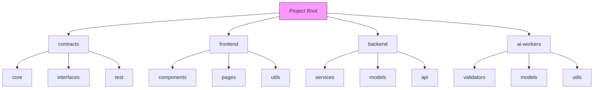
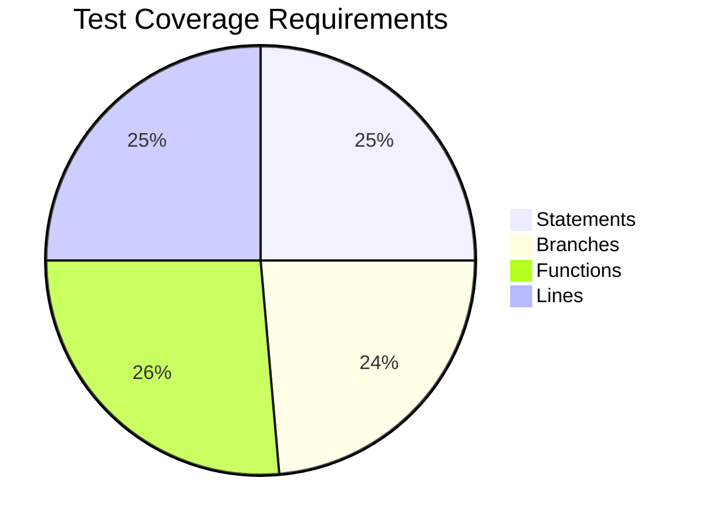
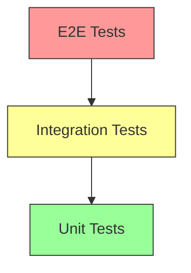

# 💻 Coding Standards


This guide outlines the coding standards and best practices for contributing to the AURA Protocol. Following these standards ensures code quality, maintainability, and consistency across the codebase.


## Code Organization





### Directory Structure
* `/contracts`: Smart contracts and blockchain logic
* `/frontend`: Next.js web application
* `/backend`: Node.js services
* `/ai-workers`: AI validation workers


Keep related files close together and maintain a clear separation of concerns.




### Naming Conventions

1. **Smart Contracts**
   ```typescript
   // Interfaces
   ISkillValidator.sol
   IReputationOracle.sol
   
   // Implementations
   SkillValidator.sol
   ReputationOracle.sol
   
   // Tests
   SkillValidator.test.ts
   ReputationOracle.test.ts
   ```

2. **Frontend Components**
   ```typescript
   // Components
   SkillCard.tsx
   ReputationBadge.tsx
   
   // Pages
   skills.tsx
   reputation.tsx
   
   // Hooks
   useSkillValidation.ts
   useReputation.ts
   ```


Always use PascalCase for components and camelCase for utilities.




### Import Organization

```typescript
// External imports
import { ethers } from 'ethers';
import React from 'react';

// Internal imports
import { SkillValidator } from '@/contracts';
import { useReputation } from '@/hooks';

// Style imports
import styles from './Component.module.css';
```


Group imports by type and maintain consistent ordering across files.




## Code Style



### TypeScript/JavaScript

```typescript
// Good ✅
interface SkillValidation {
  skillId: string;
  evidence: string[];
  timestamp: number;
  validator: string;
}

function validateSkill(
  skill: SkillValidation,
  options: ValidationOptions
): Promise<boolean> {
  // Implementation
}

// Bad ❌
interface skillValidation {
  skillId:string,evidence:string[],timestamp:number,validator:string
}

function validate_skill(s: skillValidation, o: ValidationOptions): Promise<boolean> {
  // Implementation
}
```

### Solidity

```solidity
// Good ✅
contract SkillValidator is ISkillValidator {
    mapping(address => Skill[]) private _userSkills;
    
    function validateSkill(
        address user,
        uint256 skillId
    ) external override returns (bool) {
        // Implementation
    }
}

// Bad ❌
contract skillvalidator is iskillvalidator{
    mapping(address=>Skill[]) userSkills;
    function validateskill(address u,uint256 s)external override returns(bool){
        // Implementation
    }
}
```


Use Prettier and ESLint for consistent formatting across the codebase.




### Variable Naming

```typescript
// Constants
const MAX_RETRIES = 3;
const DEFAULT_TIMEOUT = 5000;

// Variables
let currentUser: User;
let validationResult: boolean;

// Private variables
private _skillCache: Map<string, Skill>;
private _validatorInstance: Validator;

// Interfaces and Types
interface ISkillValidator {
  // ...
}

type ValidationResult = {
  // ...
};
```

### Function Naming

```typescript
// Actions
function validateSkill() { }
function updateReputation() { }

// Queries
function getSkillById() { }
function hasValidation() { }

// Event handlers
function handleValidationComplete() { }
function onReputationUpdate() { }
```


Be descriptive with names and avoid abbreviations unless widely understood.




### JSDoc Comments

```typescript
/**
 * Validates a user's skill based on provided evidence
 * @param {string} userId - The user's unique identifier
 * @param {string} skillId - The skill being validated
 * @param {Evidence[]} evidence - Array of evidence items
 * @returns {Promise<ValidationResult>} The validation result
 * @throws {ValidationError} If evidence is invalid
 */
async function validateUserSkill(
  userId: string,
  skillId: string,
  evidence: Evidence[]
): Promise<ValidationResult> {
  // Implementation
}
```

### Solidity NatSpec

```solidity
/// @title Skill Validation Contract
/// @author AURA Protocol Team
/// @notice Handles the validation of user skills
/// @dev Implements ISkillValidator interface
contract SkillValidator is ISkillValidator {
    /// @notice Validates a user's skill
    /// @param user Address of the user
    /// @param skillId ID of the skill to validate
    /// @return success Whether validation was successful
    function validateSkill(
        address user,
        uint256 skillId
    ) external override returns (bool success) {
        // Implementation
    }
}
```


Documentation should explain the "why" not just the "what" of the code.




## Testing Standards



### Test Organization

```typescript
describe('SkillValidator', () => {
  describe('validateSkill', () => {
    it('should validate skill with valid evidence', async () => {
      // Test implementation
    });

    it('should reject invalid evidence', async () => {
      // Test implementation
    });

    it('should handle validation timeout', async () => {
      // Test implementation
    });
  });
});
```


Follow the Arrange-Act-Assert pattern in test cases.




### Coverage Thresholds



| Component | Minimum Coverage |
|-----------|-----------------|
| Smart Contracts | 100% |
| Core Logic | 90% |
| UI Components | 85% |
| Utilities | 80% |


Pull requests with coverage below thresholds will not be merged.




### Testing Pyramid



1. **Unit Tests**
   * Individual functions
   * Component rendering
   * Utility methods

2. **Integration Tests**
   * API endpoints
   * Contract interactions
   * Component integration

3. **E2E Tests**
   * User flows
   * Network integration
   * Full application


Focus on unit tests for quick feedback and maintainable code.




## Security Guidelines



### Security Checklist

1. **Access Control**
   ```solidity
   // Good ✅
   modifier onlyValidator() {
       require(validators[msg.sender], "Not authorized");
       _;
   }
   
   function validateSkill() external onlyValidator {
       // Implementation
   }
   ```

2. **Input Validation**
   ```solidity
   function processEvidence(bytes calldata evidence) external {
       require(evidence.length > 0, "Empty evidence");
       require(evidence.length <= MAX_EVIDENCE_SIZE, "Evidence too large");
       // Process evidence
   }
   ```

3. **Reentrancy Protection**
   ```solidity
   mapping(address => uint256) private _balances;
   
   function withdraw() external {
       uint256 amount = _balances[msg.sender];
       require(amount > 0, "No balance");
       _balances[msg.sender] = 0; // Update before transfer
       (bool success, ) = msg.sender.call{value: amount}("");
       require(success, "Transfer failed");
   }
   ```


Always follow the Checks-Effects-Interactions pattern.




### API Security Best Practices

1. **Authentication**
   ```typescript
   // JWT Validation
   const validateToken = (token: string): User => {
     try {
       return jwt.verify(token, process.env.JWT_SECRET);
     } catch (error) {
       throw new AuthError('Invalid token');
     }
   };
   ```

2. **Rate Limiting**
   ```typescript
   const rateLimiter = rateLimit({
     windowMs: 15 * 60 * 1000, // 15 minutes
     max: 100 // limit each IP to 100 requests per windowMs
   });
   
   app.use('/api/', rateLimiter);
   ```

3. **Input Sanitization**
   ```typescript
   const sanitizeInput = (input: unknown): string => {
     if (typeof input !== 'string') {
       throw new ValidationError('Invalid input type');
     }
     return DOMPurify.sanitize(input.trim());
   };
   ```


Never trust user input and always validate on the server side.




### Frontend Security Measures

1. **XSS Prevention**
   ```typescript
   // Good ✅
   const UserInput: React.FC<{content: string}> = ({content}) => {
     return <div>{sanitizeHtml(content)}</div>;
   };
   
   // Bad ❌
   const UserInput: React.FC<{content: string}> = ({content}) => {
     return <div dangerouslySetInnerHTML={{__html: content}} />;
   };
   ```

2. **CSRF Protection**
   ```typescript
   const api = axios.create({
     headers: {
       'X-CSRF-Token': getCsrfToken(),
       'Content-Type': 'application/json'
     }
   });
   ```

3. **Secure Storage**
   ```typescript
   // Good ✅
   const storeAuthToken = (token: string) => {
     sessionStorage.setItem('auth_token', token);
   };
   
   // Bad ❌
   const storeAuthToken = (token: string) => {
     localStorage.setItem('auth_token', token);
   };
   ```


Use security headers and implement Content Security Policy (CSP).




## Performance Guidelines



### Gas Optimization

```solidity
// Good ✅
contract GasEfficient {
    uint256[] private _array;
    
    function batchProcess(uint256[] calldata items) external {
        uint256 len = items.length;
        for (uint256 i; i < len; ++i) {
            _array.push(items[i]);
        }
    }
}

// Bad ❌
contract GasInefficient {
    uint256[] private _array;
    
    function batchProcess(uint256[] memory items) external {
        for (uint256 i = 0; i < items.length; i++) {
            _array.push(items[i]);
        }
    }
}
```


Use calldata for read-only arrays and strings in external functions.




### React Performance

```typescript
// Good ✅
const MemoizedComponent = React.memo(({data}) => {
  return <div>{data.map(renderItem)}</div>;
});

// Bad ❌
const Component = ({data}) => {
  return <div>{data.map(renderItem)}</div>;
};
```


Use React.memo, useMemo, and useCallback for expensive computations.




### API Performance

```typescript
// Good ✅
const getCachedData = async (key: string) => {
  const cached = await redis.get(key);
  if (cached) return JSON.parse(cached);
  
  const data = await db.query(/* ... */);
  await redis.set(key, JSON.stringify(data), 'EX', 3600);
  return data;
};

// Bad ❌
const getData = async () => {
  return await db.query(/* ... */);
};
```


Implement caching strategies and optimize database queries.




## Next Steps


Ready to contribute?
* [🔍 Review Pull Request Guidelines](./21-contribution-workflow.md)
* [📚 Read Development Setup](../get-started/01-quickstart.md)
* [💬 Join Developer Discord](https://discord.gg/aura-dev)



Need help with coding standards? Check our [Developer Forum](https://forum.aura.protocol/dev) or ask in Discord!

