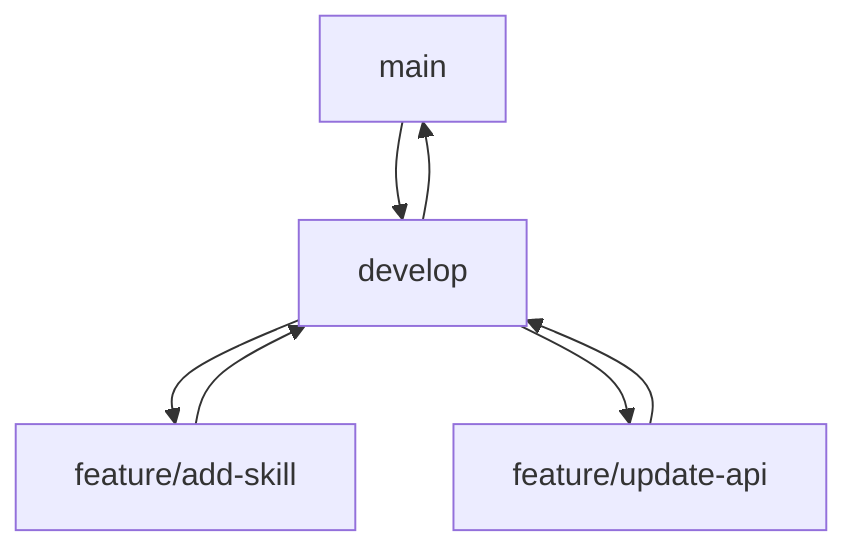

# 🚀 Developer Environment Setup

## Overview

This document provides comprehensive setup instructions for the AURA Protocol development environment. It covers all necessary tools, configurations, and best practices for contributing to the codebase.

## Development Prerequisites

### Required Tools

| Tool           | Version               | Purpose                                      |
| -------------- | --------------------- | -------------------------------------------- |
| Node.js & Yarn | >= 18.x, Yarn >= 1.22 | JavaScript runtime and package management    |
| Docker         | >= 24.x               | Container runtime for local services         |
| Git            | >= 2.30               | Version control                              |
| PostgreSQL CLI | >= 13                 | Database management                          |
| Redis CLI      | >= 6.x                | Cache and queue management                   |
| Hardhat        | >= 2.x                | Ethereum development environment             |
| Terraform      | >= 1.x                | Infrastructure as Code                       |
| AWS CLI        | >= 2.x                | Cloud infrastructure management              |
| kubectl        | >= 1.24               | Kubernetes cluster management                |
| Helm           | >= 3.x                | Kubernetes package management                |
| VS Code        | Latest                | Recommended IDE                              |

### Installation Commands

```bash
# macOS (using Homebrew)
brew install node yarn docker git postgresql redis terraform awscli kubectl helm
brew install --cask visual-studio-code

# Linux (Ubuntu/Debian)
curl -fsSL https://deb.nodesource.com/setup_18.x | sudo -E bash -
sudo apt-get install -y nodejs docker.io git postgresql redis
sudo npm install -g yarn

# Install Hardhat globally
npm install -g hardhat
```

## Repository Structure

```plaintext
aura-protocol/
├── apps/                  # Frontend applications
│   ├── web/              # Main dApp
│   └── admin/            # Admin dashboard
├── packages/             # Shared packages
│   ├── contracts/        # Smart contracts
│   ├── sdk/              # JavaScript SDK
│   └── ui/               # Shared UI components
├── services/             # Backend services
│   ├── api/              # Main API service
│   ├── validator/        # AI validation service
│   └── indexer/          # Blockchain indexer
├── tools/                # Development tools
├── docs/                 # Documentation
└── iac/                  # Infrastructure code
```

## Local Environment Setup

### 1. Repository Setup

```bash
# Clone repository
git clone https://github.com/aura-protocol/aura-monorepo.git
cd aura-monorepo

# Install dependencies
yarn install
```

### 2. Environment Configuration

```bash
# Copy environment templates
cp .env.example .env
cp apps/web/.env.example apps/web/.env
cp services/api/.env.example services/api/.env

# ⚠️ IMPORTANT: Environment variables to configure
# Replace these placeholders with your actual values
# Never commit real credentials to version control
DATABASE_URL=<your-database-url>        # Format: postgresql://<user>:<pass>@<host>:<port>/<db>
REDIS_URL=<your-redis-url>              # Format: redis://<host>:<port>
BASE_TESTNET_RPC=<your-rpc-url>         # Your Base Goerli RPC endpoint
PRIVATE_KEY=<your-development-key>      # ⚠️ Use a development-only wallet key
API_URL=http://localhost:3000           # Local development API URL
```

### 3. Database Setup

```bash
# Start local services
docker-compose up -d postgres redis

# Initialize database
cd services/api
yarn prisma migrate dev
```

### 4. Smart Contract Setup

```bash
# Install Hardhat dependencies
cd packages/contracts
yarn install

# Compile contracts
yarn compile

# Run local blockchain
yarn chain

# Deploy contracts (separate terminal)
yarn deploy:local
```

### 5. Start Development Services

```bash
# Start API service
cd services/api
yarn dev

# Start AI validator
cd services/validator
yarn dev

# Start web application
cd apps/web
yarn dev
```

## Development Workflow

### Git Branching Strategy



### Branch Naming Convention

- `main`: Production-ready code
- `develop`: Integration branch
- `feature/*`: Feature development
- `fix/*`: Bug fixes
- `release/*`: Release preparation

### Commit Standards

```bash
# Commit format
<type>(<scope>): <description>

# Types
feat: New feature
fix: Bug fix
docs: Documentation
style: Formatting
refactor: Code restructuring
test: Adding tests
chore: Maintenance
```

## Testing Framework

### Contract Testing

```bash
cd packages/contracts
yarn test                 # Run all tests
yarn test:coverage        # Generate coverage report
yarn test:gas            # Gas usage analysis
```

### API Testing

```bash
cd services/api
yarn test                # Unit tests
yarn test:e2e            # E2E tests
yarn test:coverage       # Coverage report
```

### Frontend Testing

```bash
cd apps/web
yarn test                # Run tests
yarn test:watch         # Watch mode
yarn test:coverage      # Coverage report
```

## Quality Gates

### Code Quality Checks

```bash
# Lint checks
yarn lint                # Run ESLint
yarn prettier           # Run Prettier

# Type checking
yarn type-check         # TypeScript checks

# Security scanning
yarn audit             # Dependencies audit
```

### CI/CD Pipeline Gates

1. All tests passing
2. Code coverage ≥ 90%
3. No lint errors
4. Security audit passing
5. Successful contract verification

## Development Tools

### VS Code Extensions

```json
{
  "recommendations": [
    "dbaeumer.vscode-eslint",
    "esbenp.prettier-vscode",
    "juanblanco.solidity",
    "graphql.vscode-graphql",
    "prisma.prisma"
  ]
}
```

### Local Development URLs

- Web App: `http://localhost:3000`
- API Docs: `http://localhost:4000/docs`
- GraphQL Playground: `http://localhost:4000/graphql`
- Contract Deployment: `http://localhost:8545`

## Troubleshooting

### Common Issues

1. **Database Connection**
   ```bash
   # Check database status
   docker ps | grep postgres
   # Reset database
   yarn db:reset
   ```

2. **Smart Contract Deployment**
   ```bash
   # Clear cache and artifacts
   yarn clean
   # Redeploy contracts
   yarn deploy:local
   ```

3. **Node.js Version**
   ```bash
   # Use nvm to manage Node versions
   nvm use 18
   # Clear node_modules
   yarn clean:all && yarn install
   ```

## Getting Started Tasks

1. **Initial Setup Verification**
   ```bash
   yarn verify:setup     # Runs setup verification
   ```

2. **First Contribution**
   ```bash
   git checkout -b feature/first-change
   # Make changes
   yarn test            # Ensure tests pass
   git commit -m "feat: first contribution"
   git push origin feature/first-change
   ```

3. **Local Development**
   ```bash
   yarn dev:all         # Starts all services
   ```

## Support Resources

- Internal Documentation: `/docs`
- API Reference: `/docs/api`
- Contract Documentation: `/docs/contracts`
- Developer FAQ: `/docs/faq.md`
- Support Channel: `#dev-support` on Discord 

## Security Best Practices

### Sensitive Data Handling

1. **Environment Variables**
   - Never commit `.env` files to version control
   - Use different keys for development and production
   - Rotate sensitive credentials regularly

2. **Private Keys**
   - Use development-only wallet keys for local testing
   - Never share or expose production keys
   - Use hardware wallets for production deployments

3. **API Keys**
   - Use restricted API keys with minimum required permissions
   - Set up proper key rotation policies
   - Monitor API key usage for suspicious activity

4. **Database Credentials**
   - Use strong, unique passwords
   - Restrict database access to necessary IP ranges
   - Regular security audits of database access