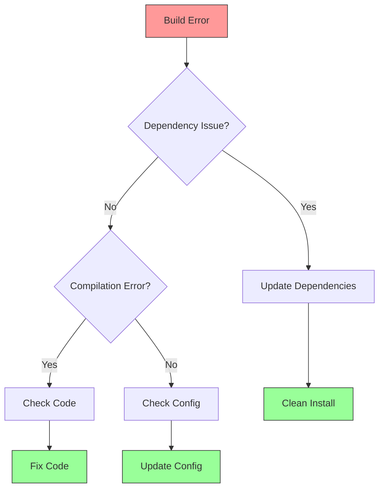
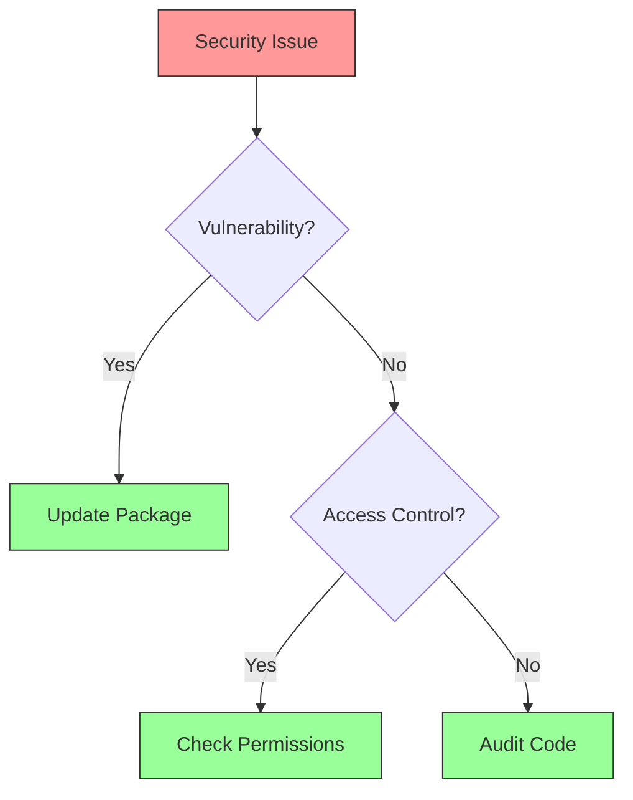

# 🔧 Troubleshooting Guide


This guide helps you diagnose and resolve common issues encountered while working with the AURA Protocol. If you can't find a solution here, please reach out to our developer support team.


## Common Issues



### Build Problems



1. **Node.js Version Mismatch**
   ```bash
   # Check Node version
   node -v
   
   # Use correct version
   nvm use 16
   
   # Install dependencies
   npm clean-install
   ```

2. **Build Cache Issues**
   ```bash
   # Clear cache
   npm run clean
   
   # Remove build artifacts
   rm -rf .next
   rm -rf dist
   
   # Rebuild
   npm run build
   ```


Always use the Node.js version specified in `.nvmrc`.




### Smart Contract Problems

1. **Deployment Failures**
   ```bash
   # Check network
   npx hardhat network
   
   # Clean artifacts
   npx hardhat clean
   
   # Compile and deploy
   npx hardhat compile
   npx hardhat deploy
   ```

2. **Gas Estimation**
   ```solidity
   // Optimize gas usage
   for (uint i; i < len;) {
       // Loop body
       unchecked { ++i; }
   }
   ```


Never deploy unaudited contracts to mainnet.




### Network Connectivity

1. **RPC Endpoints**
   ```typescript
   const provider = new ethers.providers.JsonRpcProvider(
     process.env.RPC_URL,
     {
       timeout: 30000,
       retry: {
         retries: 3
       }
     }
   );
   ```

2. **Connection Timeouts**
   * Check firewall settings
   * Verify RPC endpoints
   * Test network connectivity


Use multiple RPC providers for redundancy.




## Development Issues



### Test Failures

1. **Unit Test Issues**
   ```typescript
   // Mock external dependencies
   jest.mock('@/services/validator', () => ({
     validateSkill: jest.fn().mockResolvedValue(true)
   }));
   
   // Reset mocks between tests
   beforeEach(() => {
     jest.clearAllMocks();
   });
   ```

2. **Integration Test Failures**
   * Check test database
   * Verify environment variables
   * Ensure clean test state
   * Check network conditions

3. **Test Timeouts**
   ```typescript
   // Increase timeout for slow tests
   jest.setTimeout(30000);
   
   // Use faster alternatives
   jest.useFakeTimers();
   ```


Run tests in isolation if experiencing intermittent failures.




### UI Problems

1. **Rendering Issues**
   ```typescript
   // Check component mounting
   useEffect(() => {
     console.log('Component mounted');
     return () => console.log('Component unmounted');
   }, []);
   
   // Debug props
   console.log('Props:', props);
   ```

2. **State Management**
   ```typescript
   // Debug Redux state
   const state = useSelector((state) => {
     console.log('Current state:', state);
     return state.user;
   });
   ```

3. **Performance Issues**
   * Use React DevTools
   * Check render cycles
   * Optimize re-renders
   * Profile components


Remove all console.log statements before deployment.




### API Problems

1. **Request Failures**
   ```typescript
   // Add request logging
   axios.interceptors.request.use(request => {
     console.log('Request:', request);
     return request;
   });
   
   // Add response logging
   axios.interceptors.response.use(
     response => {
       console.log('Response:', response);
       return response;
     },
     error => {
       console.error('Error:', error.response);
       return Promise.reject(error);
     }
   );
   ```

2. **Rate Limiting**
   ```typescript
   // Implement retry logic
   const fetchWithRetry = async (url: string, retries = 3) => {
     try {
       return await axios.get(url);
     } catch (error) {
       if (retries > 0 && error.response?.status === 429) {
         await sleep(1000);
         return fetchWithRetry(url, retries - 1);
       }
       throw error;
     }
   };
   ```


Use tools like Postman for API debugging.




## Environment Issues



### Config Problems

1. **Environment Variables**
   ```bash
   # Check env files
   cat .env
   
   # Verify variables
   echo $NODE_ENV
   echo $RPC_URL
   
   # Load environment
   source .env
   ```

2. **Configuration Files**
   * Check `config.json`
   * Verify `hardhat.config.ts`
   * Review `.env.example`


Never commit sensitive environment variables.




### Dependency Issues

1. **Version Conflicts**
   ```bash
   # Check dependencies
   npm list
   
   # Update packages
   npm update
   
   # Fix vulnerabilities
   npm audit fix
   ```

2. **Peer Dependencies**
   * Review package.json
   * Check compatibility
   * Update dependencies


Use `npm-check-updates` for dependency management.




### Security Issues



1. **Common Issues**
   * Package vulnerabilities
   * Access control bugs
   * Input validation
   * Authentication issues


Report security issues privately to security@aura.protocol




## Performance Issues



### Gas Optimization

1. **Storage Optimization**
   ```solidity
   // Pack variables
   contract Optimized {
       // Packed into one slot
       uint128 a;
       uint128 b;
       
       // Separate slots
       uint256 c;
       uint256 d;
   }
   ```

2. **Loop Optimization**
   ```solidity
   // Gas efficient loop
   function processArray(uint[] calldata items) external {
       uint len = items.length;
       for (uint i; i < len;) {
           // Process item
           unchecked { ++i; }
       }
   }
   ```


Use the gas reporter to track optimization progress.




### UI Optimization

1. **React Performance**
   ```typescript
   // Memoize expensive calculations
   const memoizedValue = useMemo(() => {
     return expensiveCalculation(deps);
   }, [deps]);
   
   // Memoize callbacks
   const memoizedCallback = useCallback(() => {
     doSomething(deps);
   }, [deps]);
   ```

2. **Bundle Optimization**
   * Use code splitting
   * Lazy load components
   * Optimize images
   * Minimize CSS


Use Lighthouse for performance monitoring.




### Backend Optimization

1. **Caching Strategy**
   ```typescript
   // Implement caching
   const cache = new NodeCache({ stdTTL: 600 });
   
   async function getCachedData(key: string) {
     const cached = cache.get(key);
     if (cached) return cached;
     
     const data = await fetchData();
     cache.set(key, data);
     return data;
   }
   ```

2. **Query Optimization**
   * Use proper indexes
   * Optimize joins
   * Implement pagination
   * Cache results


Monitor API performance using tools like New Relic.




## Getting Help



### Community Resources

1. **Discord Channels**
   * #dev-help
   * #troubleshooting
   * #general-support

2. **GitHub Issues**
   * Search existing issues
   * Create detailed reports
   * Follow templates


Join our [Developer Discord](https://discord.gg/aura-dev) for real-time help.




### Documentation Resources

1. **Technical Docs**
   * API Reference
   * Architecture Guide
   * Best Practices

2. **Tutorials**
   * Getting Started
   * Common Issues
   * Advanced Topics


Check our [Documentation Portal](https://docs.aura.protocol) for guides.




### Professional Support

1. **Enterprise Support**
   * Priority response
   * Direct assistance
   * Custom solutions

2. **Security Issues**
   * Private reporting
   * Quick resolution
   * Expert support


For urgent issues, contact support@aura.protocol




## Next Steps


Still need help?
* [💬 Join Developer Chat](https://discord.gg/aura-dev)
* [📝 Submit Issue](https://github.com/aura-protocol/aura/issues/new)
* [📚 Read FAQs](./91-faqs.md)



Remember to check our [GitHub Discussions](https://github.com/aura-protocol/aura/discussions) for community solutions!
 